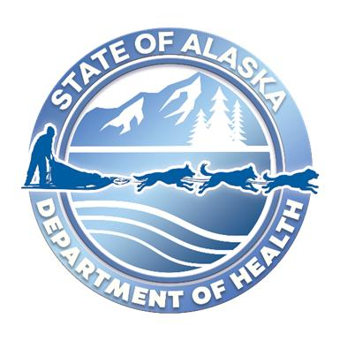

**STATE OF ALASKA REQUEST FOR PROPOSALS**

**Eligibility Modernization Milestone 2: Increments 1-5**

RFP **2025-1600-0188**

Issued DATE

The Alaska Department of Health (DOH) is soliciting proposals for
qualified contractors to support the continuing modernization
development of the public assistance integrated eligibility system.

**ISSUED BY:**
 
Department of Health 
Division of Public Assistance

**PRIMARY CONTACT:**
 
Jackie Lea 
Procurement Officer 
jacqueline.lea@alaska.gov 
907.759.3319 

**OFFERORS ARE NOT REQUIRED TO RETURN THIS FORM.**

**Important Notice**: If you received this solicitation from the
State of Alaska’s “online public notice” web site, you must register
with the procurement officer listed in this document to receive
notification of subsequent amendments. Failure to contact the
procurement officer may result in the rejection of your offer.

**TABLE OF CONTENTS**

### Section 1. INTRODUCTION & INSTRUCTIONS

[Sec. 1.01 Purpose of the RFP](#sec-101-purpose-of-the-rfp)

[Sec. 1.02 Budget](#sec-102-budget)

[Sec. 1.03 Deadline for Receipt of Proposals](#sec-103-deadline-for-receipt-of-proposals)

[Sec. 1.04 Mandatory Requirements](#sec-104-mandatory-requirements)

[Sec. 1.05 Required Review](#sec-105-required-review)

[Sec. 1.06 Questions Prior to Deadline for Receipt of Proposals](#sec-106-questions-prior-to-deadline-for-receipt-of-proposals)

[Sec. 1.07 Return Instructions](#sec-107-return-instructions)

[Sec. 1.08 Assistance to Offerors With a Disability](#sec-108-assistance-to-offerors-with-a-disability)

[Sec. 1.09 Amendments to Proposals](#sec-109-amendments-to-proposals)

[Sec. 1.10 Amendments to the RFP](#sec-110-amendments-to-the-rfp)

[Sec. 1.11 RFP Schedule](#sec-111-rfp-schedule)

[Sec. 1.12 Pre-Proposal Conference](#sec-112-pre-proposal-conference)

[Sec. 1.13 Alternate Proposals](#sec-113-alternate-proposals)

[Sec. 1.14 News Releases](#sec-114-news-releases)

### Section 2. BACKGROUND INFORMATION

[Sec. 2.01 Background Information](#sec-201-background-information)

[Sec. 2.02 Medicaid Program Background Information](#sec-202-medicaid-program-background-information)

[Sec. 2.03 Outcomes and Measurements](#sec-203-outcomes-and-measurements)

[Sec. 2.04 Current Architecture](#sec-204-current-architecture)

### Section 3. SCOPE OF WORK & CONTRACT INFORMATION

[Sec. 3.01 Scope of Work](#sec-301-scope-of-work)

[Sec. 3.02 Product Management Requirements](#sec-302-product-management-requirements)

[Sec. 3.03 Transition Requirements](#sec-303-transition-requirements)

[Sec. 3.04 Deliverables](#sec-304-deliverables)

[Sec. 3.05 HIPAA Security Assessment Requirements](#sec-305-hipaa-security-assessment-requirements)

[Sec. 3.06 Intent to Propose and Non-Disclosure Agreement (NDA)](#sec-306-intent-to-propose-and-non-disclosure-agreement-nda)

[Sec. 3.07 HIPAA and Hitech Information Security Agreement (ISA)](#sec-307-hipaa-and-hitech-information-security-agreement-isa)

[Sec. 3.08 Information Technology (IT) Related Contractual Requirements](#sec-308-information-technology-it-related-contractual-requirements)

[Sec. 3.09 Contract Term and Work Schedule](#sec-309-contract-term-and-work-schedule)

[Sec. 3.10 Contract Type](#sec-310-contract-type)

[Sec. 3.11 Payment Procedures](#sec-311-payment-procedures)

[Sec. 3.12 Contract Payment](#sec-312-contract-payment)

[Sec. 3.13 Location of Work](#sec-313-location-of-work)

[Sec. 3.14 Third-Party Service Providers](#sec-314-third-party-service-providers)

[Sec. 3.15 Subcontractors](#sec-315-subcontractors)

[Sec. 3.16 Joint Ventures](#sec-316-joint-ventures)

[Sec. 3.17 Right to Inspect Place of Business](#sec-317-right-to-inspect-place-of-business)

[Sec. 3.18 Right of CMS Audit and Inspection](#sec-318-right-of-cms-audit-and-inspection)

[Sec. 3.19 Contract Personnel](#sec-319-contract-personnel)

[Sec. 3.20 Inspection and Modification - Reimbursement for Unacceptable Deliverables](#sec-320-inspection-and-modification---reimbursement-for-unacceptable-deliverables)

[Sec. 3.21 Contract Changes - Unanticipated Amendments](#sec-321-contract-changes---unanticipated-amendments)

[Sec. 3.22 Nondisclosure and Confidentiality](#sec-322-nondisclosure-and-confidentiality)

[Sec. 3.23 Indemnification](#sec-323-indemnification)

[Sec. 3.24 Insurance Requirements](#sec-324-insurance-requirements)

[Sec. 3.25 Termination for Default](#sec-325-termination-for-default)

[Sec. 3.26 Termination and System Operation](#sec-326-termination-and-system-operation)

### Section 4. PROPOSAL FORMAT AND CONTENT

[Sec. 4.01 RFP Submittal Forms](#sec-401-rfp-submittal-forms)

[Sec. 4.02 Special Formatting Requirements](#sec-402-special-formatting-requirements)

[Sec. 4.03 Offeror Information and Certifications (Submittal Form A)](#sec-403-offeror-information-and-certifications-submittal-form-a)

[Sec. 4.04 Experience and Qualifications (Submittal Form B)](#sec-404-experience-and-qualifications-submittal-form-b)

[Sec. 4.05 Technical Understanding and Approach (Submittal Form C)](#sec-405-technical-understanding-and-approach-submittal-form-c)

[Sec. 4.06 Approach to User Interface and User Experience (Submittal Form D)](#sec-406-approach-to-user-interface-and-user-experience-submittal-form-d)

[Sec. 4.07 Product Management Approach (Submittal Form E)](#sec-407-product-management-approach-submittal-form-e)

[Sec. 4.08 Mandatory Requirements (Submittal Form F)](#sec-408-mandatory-requirements-submittal-form-f)

[Sec. 4.09 Subcontractors (Submittal Form G)](#sec-409-subcontractors-submittal-form-g)

[Sec. 4.10 Cost Proposal (Submittal Form H)](#sec-410-cost-proposal-submittal-form-h)

[Sec. 4.11 DOH IT Contractual Requirements](#sec-411-doh-it-contractual-requirements)

### Section 5. EVALUATION CRITERIA AND CONTRACTOR SELECTION

[Sec. 5.01 Summary of Evaluation Process](#sec-501-summary-of-evaluation-process)

[Sec. 5.02 Evaluation Criteria](#sec-502-evaluation-criteria)

[Sec. 5.03 Scoring Method and Calculation](#sec-503-scoring-method-and-calculation)

[Sec. 5.04 Experience and Qualifications](#sec-504-experience-and-qualifications)

[Sec. 5.05 Technical Understanding and Approach](#sec-505-technical-understanding-and-approach)

[Sec. 5.06 Product Management Approach](#sec-506-product-management-approach)

[Sec. 5.07 Approach to User Interface and User Experience](#sec-507-approach-to-user-interface-and-user-experience)

[Sec. 5.08 Contract Cost (Cost Proposal)](#sec-508-contract-cost-cost-proposal)

[Sec. 5.09 Shortlisting](#sec-509-shortlisting)

[Sec. 5.10 Interviews of Critical Team Members](#sec-510-interviews-of-critical-team-members)

[Sec. 5.11 Cost Reasonableness](#sec-511-cost-reasonableness)

[Sec. 5.12 Contract Negotiations](#sec-512-contract-negotitations)

[Sec. 5.13 Offeror Notification of Selection](#sec-513-offeror-notification-of-selection)

### Section 6. GENERAL PROCESS AND LEGAL INFORMATION

[Sec. 6.01 Informal Debriefing](#sec-601-informal-debriefing)

[Sec. 6.02 Alaska Business License and Other Required Licenses](#sec-602-alaska-business-license-and-other-required-licenses)

[Sec. 6.03 Standard Contract Provisions](#sec-603-standard-contract-provisions)

[Sec. 6.04 Business Associate Agreement (BAA)](#sec-604-business-associate-agreement-baa)

[Sec. 6.05 Qualified Offerors](#sec-605-qualified-offerors)

[Sec. 6.06 Proposal as Part of the Contract](#sec-606-proposal-as-part-of-the-contract)

[Sec. 6.07 Additional Terms and Conditions](#sec-607-additional-terms-and-conditions)

[Sec. 6.08 Human Trafficking](#sec-608-human-trafficking)

[Sec. 6.09 Right of Rejection](#sec-609-right-of-rejection)

[Sec. 6.10 State Not Responsible for Preparation Costs](#sec-610-state-not-responsible-for-preparation-costs)

[Sec. 6.11 Disclosure of Proposal Contents](#sec-611-disclosure-of-proposal-contents)

[Sec. 6.12 Assignment](#sec-612-assignment)

[Sec. 6.13 Severability](#sec-613-severability)

[Sec. 6.14 Supplemental Terms and Conditions](#sec-614-supplemental-terms-and-conditions)

[Sec. 6.15 Solicitation Advertising](#sec-615-solicitation-advertising)

[Sec. 6.16 Site Inspection](#sec-616-site-inspection)

[Sec. 6.17 Clarification of Offers](#sec-617-clarification-of-offers)

[Sec. 6.18 Discussions with Offerors](#sec-618-discussions-with-offerors)

[Sec. 6.19 Federally Imposed Tariffs](#sec-619-federally-imposed-tariffs)

[Sec. 6.20 Protest](#sec-620-protest)

### Section 7. ATTACHMENTS

[Sec. 7.01 Attachment 1 -- Submittal Forms A - H](#sec-701-attachment-1----submittal-forms-a---h)

[Sec. 7.02 Attachment 2 -- DOH IT Contractual Requirements](#sec-702-attachment-2----doh-it-contractual-requirements)

[Sec. 7.03 Attachment 3 -- Submittal Form I - Cost Proposal](#sec-703-attachment-3----submittal-form-i---cost-proposal)

[Sec. 7.04 Attachment 4 -- Standard Agreement Form - Appendix A - F](#sec-704-attachment-4----standard-agreement-form-appendix-a---f)

[Sec. 7.05 Attachment 5 -- Federal Regulations](#sec-705-attachment-5----federal-regulations)

[Sec. 7.06 Attachment 6 -- Non-Disclosure-Agreement-and-Intent-to-Propose](#sec-706-attachment-6----non-disclosure-agreement-and-intent-to-propose)

[Sec. 7.07 Attachment 7 -- Quality Assurance Plan (QAP) and Service Level Agreement (SLA)](#sec-707-attachment-7----quality-assurance-plan-qap-and-service-level-agreement-sla)

#  Section 1. Introduction & Instructions

## Sec. 1.01 Purpose of the RFP

The Alaska Department of Health (DOH), Division of Public Assistance
(DPA), Eligibility Modernization Project Management Office (EMO) is
soliciting proposals for a software development and implementation
contractor by providing:
- Deploy a new modular integration platform using Microsoft Azure
  integration services (e.g. Azure API Management).
  - Ability to connect to the legacy Eligibility Information System
    (EIS) data sources
  - Ability to connect to Alaska’s Resource for Integrated Eligibility
    Services (ARIES) data
  - Ability to receive application data from the new self-service portal
  - Open to connecting to other data types, systems, and applications
- Update or deploy new backend services
  - Rules
  - Notices
  - Batch
  - Benefit issuance
  - Benefit recovery
  - Self-service for applicants
  - Both public and internal portals with appropriate workflows
- Deploy new front end web application that interacts with API platform
  as well as new and existing backend services
  - Workers can input information needed for eligibility determinations
  - Workers can view information about clients and cases from multiple
    data sources

The State has been working with its federal partners and stakeholders to
implement a continuously updated roadmap to complete the remaining work
to implement a fully integrated modern eligibility system, supporting
all existing public assistance programs.

The roadmap illustrates milestones to be achieved while using a modular
approach emphasizing agile product development and DevOps practices,
incrementally implementing improvements in a measurable and sustainable
way in a continuing migration of programs from the legacy system.

More detailed information can be found in SECTION 3 SCOPE OF WORK &
CONTRACTUAL INFORMATION.

## Sec. 1.02 Budget

The Alaska Department of Health, Division of Public Assistance,
estimates a budget of \$xx,xxx,xxx.oo dollars for completion of this
project. Proposals priced at more than \$xx,xxx,xxx.oo will be
considered non-responsive and rejected.

Approval or continuation of a contract resulting from this RFP is
contingent upon legislative appropriation or federal funding.

## Sec. 1.03 Deadline for Receipt of Proposals

Proposals must be received no later than **TIME** standard Alaska Time
on **DATE**. Late proposals or amendments will be disqualified and not
opened or accepted for evaluation.

## Sec. 1.04 Mandatory Requirements

To be considered responsive for this RFP, an offeror must meet the
mandatory minimum experience requirements that are provided in
**Submittal Form F – Mandatory Requirements.** Failure to meet all these
requirements will result in immediate disqualification.

## Sec. 1.05 Required Review

Offerors should carefully review this solicitation for defects and
questionable or objectionable material. Comments concerning defects and
questionable or objectionable material should be made in writing and
received by the procurement officer at least ten days before the
deadline for receipt of proposals. This will allow time for the issuance
of any necessary amendments. It will also help prevent the opening of a
defective proposal and exposure of offeror's proposals upon which award
could not be made.

## Sec. 1.06 Questions Prior to Deadline for Receipt of Proposals

Questions or comments regarding this RFP shall be submitted as issues
within this RFP’s GitHub repository no later than **4:00 PM** Alaska
Standard Time on **XXX X, 2025**, to allow the State sufficient time
to respond. All questions and comments will be publicly available.
Please add yourself as a watcher on the Milestone 2 RFP GitHub
Repository if your firm would like updates about changes and comments.
Questions or comments received after the required deadline may not be
answered.

All questions must be in writing and directed to the procurement officer
and least ten days before the deadline for receipt of proposals. The
interested party must confirm telephone conversations in writing.

Two types of questions generally arise. One may be answered by directing
the questioner to a specific section of the RFP. These questions may be
answered over the telephone. Other questions may be more complex and may
require a written amendment to the RFP. The procurement officer will
make that decision.

## Sec. 1.07 Return Instructions

Offerors must submit their proposals via email. The technical proposal
and cost proposal must be saved as separate documents and emailed to
<doh.procurement.proposals@alaska.gov> as separate, clearly labeled
attachments. The email must contain the RFP number in the subject line.

The maximum size of a single email (including all text and attachments)
that can be received by the state is 25mb (megabytes). If the email
containing the proposal exceeds this size, the proposal must be sent in
multiple emails that are each less than 25 megabytes.

Please note that email transmission is not instantaneous. Similar to
sending a hard copy proposal, if you are emailing your proposal, the
state recommends sending it enough ahead of time to ensure the email is
delivered by the deadline for receipt of proposals.

It is the offeror’s responsibility to contact the above email address to
confirm that the proposal has been received. The state is not
responsible for unreadable, corrupt, or missing attachments.

## Sec. 1.08 Assistance to Offerors with a Disability

Offerors with a disability may receive accommodation regarding the means
of communicating this RFP or participating in the procurement process.
For more information, contact the procurement officer no later than ten
days prior to the deadline for receipt of proposals.

## Sec. 1.09 Amendments to Proposals

Amendments to or withdrawals of proposals will only be allowed if
acceptable requests are received prior to the deadline that is set for
receipt of proposals. No amendments or withdrawals will be accepted
after the deadline unless they are in response to the state's request in
accordance with 2 AAC 12.290.

## Sec. 1.10 Amendments to the RFP

If an amendment is issued before the deadline for receipt of proposals,
it will be provided to all who were notified of the RFP and to those who
have registered with the procurement officer after receiving the RFP
from the State of Alaska Online Public Notice website.

After receipt of proposals, if there is a need for any substantial
clarification or material change in the RFP, an amendment will be
issued. The amendment will incorporate the clarification or change, and
a new date and time established for new or amended proposals.
Evaluations may be adjusted as a result of receiving new or amended
proposals.

## Sec. 1.11 RFP Schedule

RFP schedule set out herein represents the state’s best estimate of the
schedule that will be followed. If a component of this schedule, such as
the deadline for receipt of proposals, is delayed, the rest of the
schedule may be shifted accordingly. All times are Alaska Time.

| **Activity**| **Time**| **Date**|
|------|------|------|
| Issue Date / RFP Released               |                     |                        |
| Deadline to Submit Questions            |                     |                        |
| Deadline for Receipt of Proposals / Proposal Due Date |  |                        |
| Proposal Evaluations Start              |                     |                        |
| Interviews Complete                     |                     |                        |
| Notice of Intent to Award               |                     |                        |
| Contract Issued for Review and Signature|                     |                        |
| Contract Start Date                     |                     |                        |

This RFP does not, by itself, obligate the state. The state's obligation
will commence when the contract is approved by the Commissioner of the
Department of Health, or the Commissioner's designee. Upon written
notice to the contractor, the state may set a different starting date
for the contract. The state will not be responsible for any work done by
the contractor, even work done in good faith, if it occurs prior to the
contract start date set by the state.

## Sec. 1.12 Pre-Proposal Conference

A pre-proposal conference/teleconference will not be held for this
solicitation. Interested parties may submit questions in writing per
SEC. 1.06.

## Sec. 1.13 Alternate Proposals

Offerors may only submit one proposal for evaluation. In accordance with
2 AAC 12.830 alternate proposals (proposals that offer something
different than what is asked for) will be rejected.

## Sec. 1.14 News Releases

News releases related to this RFP will not be made without prior
approval of the project director.

#  Section 2. BACKGROUND INFORMATION

## Sec. 2.01 Background Information

Alaska Statute
[47.05.010](https://www.akleg.gov/basis/statutes.asp#47.05.010)
designates Department of Health (DOH), Division of Public Assistance
(DPA) as having responsibility for determining eligibility and
administration of Alaska’s public assistance programs. As a part of this
designation, DPA is charged with determining eligibility for each of the
programs based on state and federal regulation, governed by Alaska
Administrative Code, [Title
7](https://www.akleg.gov/basis/aac.asp#1.05). Our mission is to “promote
self-sufficiency and provide basic living expenses to Alaskans in need.”

This includes the following programs:

- Adult Public Assistance (APA)
- Alaska Temporary Assistance Program (ATAP)
- ATAP Work Services (TANF)
- Childcare Assistance
- Chronic and Acute Medical Assistance (CAMA)
- Family Nutrition
- General Relief Assistance
- Heating Assistance
- Interim Assistance
- Medicaid
  - Modified Adjusted Gross Income (MAGI)
  - Denali KidCare (SCHIP)
  - Aged, Disabled, Blind, and Long-Term Care
- Permanent Fund Dividend Hold-Harmless
- Senior Benefits
- Supplement Nutrition Assistance Program (SNAP) (aka food stamps)
- SNAP Employment and Training
- Tribal TANF
- Women, Infants, and Children Program (WIC)

DPA has federal partners, including the Centers for Medicare & Medicaid
Services (CMS), Food and Nutrition Services (FNS), and Administration of
Children and Families (ACF), who we work with to implement regulations
and program rules.

To perform this work, DPA uses several technical systems. These include
a legacy mainframe system (EIS), as well as a modern Modified Adjusted
Gross Income (MAGI) Medicaid determination platform, known as Alaska's
Resource for Integrated Eligibility Services (ARIES).

While EIS has effectively supported program administration and benefit
delivery for over 40 years, the technology on which it is based (IBM
mainframe platform, COBOL software development language and ADABAS
database management system) is becoming increasingly difficult to
maintain. Many significant changes in Public Assistance programs and
program administration have occurred since the system was placed into
production in 1984. Mandatory Federal Medicaid provisions of the ACA,
Welfare Reform, new program demands, and the continued growth and
complexity in public assistance programs are creating a shift in
business needs. The system is currently functioning well beyond the
capacity for which it was designed and does not provide the flexibility
needed to implement mandatory federal provisions.

The modern system, called ARIES, is used by over 400 users consisting of
eligibility technicians, administrative staff, and management personnel
within DPA, and contains over 200,000 benefit recipients. In addition to
these users there are multiple contractors and community partners that
access the system to assist in the public assistance program
administration. In total the ARIES system is used by over 700 users.

Greater system flexibility and robust reporting capabilities are needed
to accommodate changes driven by federal and state laws and to ensure
the long-term ability of DPA to provide efficient, economical, and
effective administration of its programs. The Division needs to pursue
implementation of a more advanced software application based on current
technology and Service Oriented Architecture (SOA) that aligns with the
Medicaid Information Technology Architecture (MITA) and compliance with
the CMS Seven Standards and Conditions. This will ensure a successful
implementation of the mandatory federal Medicaid provisions.

In addition, DPA needs a user-friendly and adaptable system to gain
efficiencies, reduce system maintenance costs, respond to increasing
service demands, improve customer service, and better support the
timeliness and accuracy of eligibility decisions.

DPA is developing a modern, integrated eligibility system that enables
staff to more efficiently issue correct and timely benefits to Alaskans
who need help meeting their basic needs. Utilizing agile development
methods and modular procurements, DPA has the goal of implementing an
eligibility system that not only meets state and federal standards, but
is user friendly for clients, eligibility staff, and technical staff.

DPA has moved away from a "big bang" waterfall acquisitions process to a
more modular approach, emphasizing user centered design, agile product
development, and DevSecOps practices. We integrate user experience,
security, and privacy into all our development work. More information
about the Eligibility Modernization project can be found
[here](https://github.com/Akhealth/EIS-Modernization/) (**be sure to add
yourself as a watcher on the overall eligibility modernization
repository to automatically get updates about changes and upcoming
procurements**). The goal of this approach is to incrementally improve
the current situation in a measurable and sustainable way, and
eventually allow the continued migration of programs away from the
previous eligibility system and onto something more modern, flexible and
maintainable.

Offerors should review this repository for information that will be
critical in constructing a quality proposal.

Of specific interest are:

[Procurement
strategy](https://github.com/akhealth/EIS-Modernization/blob/master/procurement-strategy.md)

[Modular product design
strategy](https://github.com/akhealth/EIS-Modernization/blob/master/modular-experience.md)
and our [Modular Experience and API Framework
Prototype](https://github.com/akhealth/ProtoModExp)

[How We
Work](https://github.com/akhealth/EIS-Modernization/blob/master/how-we-work.md)

[EIS Modernization Project Technical
Strategy](https://github.com/akhealth/EIS-Modernization/blob/master/tech-strategy.md)

This approach to ensuring continuing progress towards the DPA roadmap
goals is to organize product teams to work on the individual
procurements and product increments. These teams work together with the
selected vendor to complete work organized by regular sprints. These
sprints include activities like a daily or regular standup, a
retrospective held at the end of each sprint, a sprint review of work
completed, sprint planning and backlog grooming sessions.

The first product increments were improvements to the worker experience
in the ARIES System in addition to stabilizing the underlying
infrastructure (Milestone 1). In this acquisition, Milestone 2
Increments 1-5, we are looking to move the remaining Medicaid categories
off the legacy mainframe to a modern system exercising our user centered
design practices, modern software development methods and security
focused continuous deployment processes. Specific information regarding
this procurement can be found in the RFP-ARIES-Milestone 2 GitHub Repo
(**make sure to add yourself as a watcher to receive updates**).

## Sec. 2.02 Medicaid Program Background Information

The Department of Health (DOH) is the state agency designated to
administer the Alaska Medicaid program, which includes:

- Medicaid
- Denali KidCare (DKC)
- Chronic and Acute Medical Assistance

The Division of Public Assistance (DPA) is responsible for determining
the eligibility of individuals and families in need of Medicaid
benefits.

DPA administers the Medicaid program in accordance with Federal and
State laws and regulations. The Medicaid program is authorized under
Title XIX and Title XXI of the Social Security Act and the Code of
Federal Regulations, Title 42 Part 435 and Title 45 Part 233. Alaska’s
Medicaid State Plan may be viewed
[here](https://health.alaska.gov/Commissioner/Pages/MedicaidStatePlan/default.aspx).

Alaska joined the Medicaid program in September 1972. New services and
eligible groups have been added to the program since that time by the
Legislature. The Medicaid program in Alaska is authorized under Alaska
Statutes 47.07.010 - 47.07.900 and the Alaska Administrative Code, Title
7 Chapter 43 and Chapter 100.

Medicaid is jointly financed by the federal government and the state.
Certain groups of individuals and services are required by federal law,
while other optional groups of individuals and services are selected by
the State.

Medicaid benefits are a crucial component of the safety-net services
delivered through DPA. Careful assessment by DPA staff identifies the
Medicaid program best suited to meet the needs of applicant families and
individuals. As families transition from welfare to work, DPA staff
ensure that eligible family members continue to receive Transitional
Medicaid benefits. DPA staff is also responsible for determining
eligibility and issuing benefits for infants, children, pregnant women,
adults, elderly, and disabled individuals who qualify for one of the
categorical Medicaid programs.

The majority of Medicaid recipients are beneficiaries of other programs
and services administered and delivered by DPA. For example, many
recipients of ATAP benefits also receive Medicaid benefits. Many
children, young adults, and elderly or disabled persons receiving
Medicaid also receive SNAP or Adult Public Assistance benefits. Over
250,000 Alaskans receive medical benefits through the Medicaid Program.

**Modified Adjusted Gross Income (MAGI) Medicaid**

In March 2010, the Affordable Care Act (ACA) was signed into law. The
ACA is based on the Patient Protection and Affordable Care Act (Public
Law 111-148, as amended) and the Health Care and Education
Reconciliation Act (Public Law 111-152). The law as originally enacted
focuses on provisions to expand coverage, control health care costs, and
improve the health care delivery system. The ACA also included
provisions to streamline eligibility, enrollment, and renewal processes,
for example, by requiring a single application for Medicaid, CHIP, and
subsidized exchange coverage. The ACA changes for Medicaid came into
effect January 1, 2014, replacing Alaska’s Family Medicaid with MAGI
Medicaid.

The ACA established a new methodology for determining Medicaid income
eligibility for most children, pregnant women, parents, and adults. The
MAGI-based methodology considers taxable income and tax filing
relationships to determine financial eligibility for Medicaid. MAGI
replaced the former process for calculating Medicaid eligibility, which
was based on the methodologies of the Aid to Families with Dependent
Children program that ended in 1996. Some individuals are exempt from
the MAGI-based income counting rules, including those whose eligibility
is based on blindness, disability, or age (65 and older).

By allowing people seeking healthcare coverage to complete one
application that determined which health and social services programs
they or their family were eligible for, the Affordable Care Act made it
easier for people to apply for and enroll in health care coverage.

Eligibility determinations for MAGI Medicaid are made in ARIES. More
information may be found
[here](http://dpaweb.hss.state.ak.us/manuals/MAGI2/magi.htm#t=800_introduction_to_medicaid%2F800_introduction_to_medicaid.htm).

**Denali KidCare (DKC) aka State Children’s Health Insurance Program
(SCHIP)**

Denali KidCare provides excellent health insurance coverage for children
and teens through age 18, as well as for pregnant women who meet income
guidelines.

Eligibility determinations for Denali KidCare are made in ARIES.

**Adult Public Assistance (APA) and Long Term Care (LTC) Medicaid**

The applicable eligibility categories for APA and Long Term Care
Medicaid in Alaska are:
- Supplemental Security Income (SSI) Recipient
- APA Recipient
- SSI Eligible - Not Receiving Cash Payments
- APA Eligible - Not Receiving CashPayments
- SSI or APA Ineligibles for Reasons Prohibited by Medicaid
- Working Disabled Medicaid Buy-In
- Special Long Term Care
- Disabled Children at Home (TEFRA)
- “Pickle People” (Deemed an SSI)/APA recipient under the Pickle Amendment)
- “Section 1619(b)” Eligible
- SSI Disabled Children
- Disabled Widow(er)

Individuals receiving and are automatically eligible for Medicaid.

Individuals who meet the categorical requirements of APA-related
Medicaid but require an institutional living arrangement or home and
community-based care, may be eligible for Medicaid under the Special
Long Term Care category.

In addition, Alaska has the following eligibility categories that help
pay Medicare costs, but do not offer regular Medicaid coverage:

- Qualified Medicare Beneficiary (QMB);
- Qualified Disabled and Working Individuals (QDWI);
- Specified Low Income Medicare Beneficiary (SLMB)
- Specified Low Income Medicare Beneficiary Plus (SLMB PLUS).
  
Eligibility determinations for APA and LTC related categories are
currently made in EIS. Milestone 2 Increments 1-5 plans to move these
categories from the legacy EIS to the modern integrated eligibility
system. More information may be found
[here](http://dpaweb.hss.state.ak.us/manuals/adltc/adltc.htm#t=title_page.htm).

**Hospital Presumptive Eligibility (HPE)**

Hospital Presumptive Eligibility is a requirement of the Affordable Care
Act (ACA) that was effective January 1, 2014. States are required to
allow approved hospitals to presumptively determine eligibility for
certain categories of MAGI Medicaid and Breast & Cervical Cancer
Medicaid (BCCM / Ladies First).

## Sec. 2.03 Outcomes and Measurements

CMS-required outcomes for Medicaid Enterprise Systems (MES) are the
standard requirements for certification based on federal regulations and
statutes. These outcomes establish a baseline for the functionality of a
system or module, which is required to continue receiving federal
funding for operations. CMS-required outcomes also demonstrate that a
system complies with applicable federal regulations.

While some of the outcomes below have been achieved in the ARIES system
today, they must nonetheless remain a consideration for all future
development initiatives and/or system implementations. Specific metrics
have been defined for each of those outcomes; the DPA continues to
monitor those metrics seeking continual improvements. For those outcomes
below that have not yet been achieved, metrics will be developed to
facilitate measuring our success in achieving the related outcome.

|**Reference #**|**Outcome**| **Sources**|
|------|------|------|
| EE1         | The eligibility system receives, ingests, and processes the single-streamlined applications, change of circumstances, renewal forms, and any supporting documentation requested by the state (including telephonic signatures) from individuals, for all Medicaid eligibility groups and CHIP through online via multiple browsers, mail (paper), phone, and in person (e.g., via kiosk) applications to support eligibility determination for all Insurance Affordability Programs (Federal Health Insurance Exchange), state Medicaid or CHIP, State-Based Marketplace (SBM), Basic Health Program (BHP). | 42 C.F.R. §435.907, 42 C.F.R. §435.916, 42 C.F.R. §436.901 (for Guam, Puerto Rico, and the Virgin Islands)                                                                        |
| EE2         | Individuals experience a user-friendly, dynamic, online application, such that subsequent questions are based on prior answers.                                                                                                                  | 42 C.F.R. §435.907, 42 C.F.R. §436.901 (for Guam, Puerto Rico, and the Virgin Islands)                                                                                     |
| EE3         | Individuals eligible for automatic Medicaid eligibility are promptly enrolled (e.g., SSI recipients in 1634 states, individuals receiving a mandatory state supplement under a federally- or state-administered program, individuals receiving an optional State supplement per 42 C.F.R. 435.230 and deemed newborns). (Automatic enrollment in Guam, Puerto Rico, and the U.S. Virgin Islands is required only for individuals receiving cash assistance under a state plan for OAA, AFDC, AB, APTD, or AABD, and deemed newborns.) | 42 C.F.R. §435.117, 42 C.F.R. §435.909, 42 C.F.R. §436.909 and 42 C.F.R. §436.124 (for Guam, Puerto Rico, and the Virgin Islands)                                             |
| EE4         | The state correctly calculates income and household composition based on Modified Adjusted Gross Income (MAGI) and non-MAGI methodologies at application and renewal. Example business rules include subtracting 5 percentage points off FPL for applicable family size. | 42 C.F.R. §435.603, 42 C.F.R. §436.601 and 42 C.F.R. §436.811-814 (for Guam, Puerto Rico, and the Virgin Islands)                                                          |
| EE5         | The eligibility system uses automated interfaces with electronic data sources to enable real-time or near real-time, no manual touch eligibility determinations. The data sources include (but are not limited to) SSA and the Department of Homeland Security (DHS) (directly or via the Federal Data Services Hub (FDSH) state quarterly wage data, data from financial institutions for asset verification, Renewal and Redetermination Verification service through the FDSH, Public Assistance Reporting Information System (PARIS) to verify Medicaid coverage in other states. | 42 C.F.R. §435.940-965, 42 C.F.R. §435.945(d), 42 C.F.R. §436.901 (for Guam, Puerto Rico, and the Virgin Islands)                                                            |
| EE6         | Individuals who apply for Medicaid based on disability receive an eligibility determination within 90 days and all other applicants receive an eligibility determination within 45 days.                                                             | 42 C.F.R. §435.911-912, 42 C.F.R. §436.901 (for Guam, Puerto Rico, and the Virgin Islands)                                                                                   |
| EE7         | Individuals are enrolled for up to 90 days if pending verification of citizenship or immigration status.                                                                                                                                          | 42 C.F.R. §435.407, 42 C.F.R. §435.956, 42 C.F.R. §436.407 and §436.901 (for Guam, Puerto Rico, and the Virgin Islands)                                                     |
| EE8         | Individuals are enrolled pending verification of SSN.                                                                                                                                                                                           | 42 C.F.R. §435.910, 42 C.F.R. §435.956(d), 42 C.F.R. §436.901 (for Guam, Puerto Rico, and the Virgin Islands)                                                              |
| EE9         | Individuals receive system-generated timely automated (versus manual) eligibility notices and request for additional information for eligibility determination, as necessary.                                                                      | 42 C.F.R. §431.210-214, 42 C.F.R. §435.917-918, 42 C.F.R. §436.901 (for Guam, Puerto Rico, and the Virgin Islands)                                                           |
| EE10        | Individuals receive electronic notices and alerts as applicable via their preferred mode of communication e.g., email, text that notice is available in online account).                                                                         | 42 C.F.R. §431.210-214, 42 C.F.R. §435.917-918, 42 C.F.R. §436.901 (for Guam, Puerto Rico, and the Virgin Islands)                                                           |
| EE11        | Following an eligibility determination, the system promptly sends the beneficiary information to MMIS to complete enrollment into the appropriate delivery system (e.g., FFS, managed care).                                                         | 42 C.F.R. §435.914, 42 C.F.R. §436.901 (for Guam, Puerto Rico, and the Virgin Islands)                                                                                      |
| EE12        | The system receives Presumptive Eligibility (PE) applications from all approved entities in an automated manner and facilitates eligibility termination if no full Medicaid application is received by the end of the month following the month of PE determination. | 42 C.F.R. §435.1110                                                                                                                                                          |
| EE13        | The system uses electronic data sources to confirm eligibility, wherever possible, to facilitate ex-parte renewals.                                                                                                                               | 42 C.F.R. §435.916, 42 C.F.R. §436.901 (for Guam, Puerto Rico, and the Virgin Islands)                                                                                      |
| EE14        | If ex-parte renewal cannot be completed, the system can automatically generate pre-populated renewal forms and distribute those forms via individuals' preferred communication mode.                                                               | 42 C.F.R. §435.916, 42 C.F.R. §436.901 (for Guam, Puerto Rico, and the Virgin Islands)                                                                                      |
| EE15        | The system applies an automated eligibility hierarchy that places an individual in the most advantageous group for which they are eligible at initial application and renewal.                                                                    | 42 C.F.R. §435.404, 42 C.F.R. §436.404 (for Guam, Puerto Rico, and the Virgin Islands)                                                                                       |
| EE16        | The system uses automated business rules to assign accurate eligibility categories for all the mandatory and relevant optional eligibility groups at initial application and renewal. Example business rules include: Correct identification of individuals age 19-64 at or below 133 percent FPL (VIII group), Correct alignment of eligibility categories to FMAP rate. | 42 C.F.R. §435.404, 42 C.F.R. §436.404 (for Guam, Puerto Rico, and the Virgin Islands)                                                                                       |
| EE17        | Incarcerated individuals receive timely access to inpatient services and receive a timely and accurate eligibility determination upon release.                                                                                                    | 42 C.F.R. §435.1009, 42 C.F.R. §436.1005 (for Guam, Puerto Rico, and the Virgin Islands)                                                                                     |
| EE18        | Individuals whose coverage is limited to emergency services due to immigration status receive timely and accurate eligibility determination.                                                                                                    | 42 C.F.R. §435.139, 42 C.F.R. §440.255(c), 42 C.F.R. §436.128 (for Guam, Puerto Rico, and the Virgin Islands)                                                                |
| EE19        | Individuals receive timely and accurate determinations of eligibility for the three months prior to the date of application if the individual would have been eligible and received Medicaid covered services.                                      | 42 C.F.R. §435.915, 42 C.F.R. §436.901 (for Guam, Puerto Rico, and the Virgin Islands)                                                                                       |
| EE20        | Individuals are promptly enrolled with the accurate effective date of eligibility in accordance with the approved State Plan.                                                                                                                   | 42 C.F.R. §435.915, 42 C.F.R. §436.901 (for Guam, Puerto Rico, and the Virgin Islands)                                                                                       |
| EE21        | In states that have an integrated eligibility system with human services programs, the system is able to pend application for one program without having to do so for Medicaid or CHIP programs, if needed.                                         | June 18, 2013, CMS Guidance on State Alternative Applications for Health Coverage                                                                                           |
| EE22        | The state maintains a coordinated eligibility and enrollment process with all insurance affordability programs by supporting bi-directional data-sharing for application-related data and adjudication status with all relevant insurance affordability programs (FFE, CHIP, SBE if applicable, BHP if applicable). | 42 C.F.R. §435.1200                                                                                                                                                          |
| EE23        | Account Transfer information for individuals applying to the FFE from a determination state is automatically ingested and the state promptly enrolls individuals determined eligible by the FFE.                                                   | 42 C.F.R. §435.1200                                                                                                                                                          |
| EE24        | Account Transfer information for individuals applying at the FFE from an assessment state is automatically ingested and the state conducts only the remaining verifications necessary to complete the determination process for individuals assessed as potential eligible by the FFE. | 42 C.F.R. §435.1200                                                                                                                                                          |
| EE25        | The system receives and responds to requests from the FFE in real-time to confirm whether an individual applying for coverage through the FFE currently has Minimum Essential Coverage through Medicaid or CHIP.                                 | 42 C.F.R. §435.1200                                                                                                                                                          |
| EE26        | Persons with disabilities or with Limited English Proficiency (LEP) can submit a single, streamlined application with any necessary assistance (e.g., TTY for the hearing impaired for phone applications, and language assistance for persons with LEP). | 42 C.F.R. §435.905, 42 C.F.R. §435.908, 42 C.F.R. §436.901 (for Guam, Puerto Rico, and the Virgin Islands)                                                                  |
| EE27        | Beneficiaries and applicants can submit an appeal against an adverse action via multiple channels (e.g., online, phone, mail, in person) and the appeal status and adjudication of an appeal can easily be accessed by necessary state staff and appellants. | 42 C.F.R. §431.221                                                                                                                                                          |

The Alaska Department of Health considers these outcomes to be critical
to the overall implementation success of this project. The outcomes will
be documented, measured, and reported throughout the life of this
contract and beyond.

## Sec. 2.04 Current Architecture

Below is information describing the current mix of systems that are used
to determine public assistance program eligibility. The overall
modernization strategy for the public assistance system is contained in
the DOH [GitHub Repository](https://github.com/akhealth/). The following
is for reference only and connects to the scope of work described in
Section 3 SCOPE OF WORK & CONTRACTUAL INFORMATION.

**Alaska's Resource for Integrated Eligibility Services (ARIES)**

The ARIES system is:
- Hosted in the Azure Commercial Cloud on a mix of:
  - Azure Infrastructure-as-a-Service (IaaS) (this includes a
    development, staging/user testing, training, and production
    environments)
  - Azure Platform-as-a-Service (PaaS) (this includes Azure App Services
    where a person search application is hosted with an instance for
    development, test, and production)
  - Limited Azure Integration Services (preferred over MuleSoft)
- Department of Health data center (on premises)
  - Servers that support the unified search application (Windows-based)
- IBM based technology stack
  - Base WAS – WebSphere Application Server
  - Network Deployment WAS – WebSphere Application Server
  - Operational Decision Management – ODM
  - IBM Security Verify Access Appliance – ISVA
- Java
  - Spring Boot Framework
- MuleSoft community edition ESB
- Quartz Enterprise Job Scheduler
- OpenText ExStream (the division is considering migrating to a new
  enterprise content management system (ECM))
- PostgreSQL (primary application database)
- Atlassian JIRA for issue tracking
- Azure DevOps
- Aha! (used for road mapping and deployment plans)
- Modern Requirements (tracks testing activities)
- Microsoft SQL and Microsoft SQL Server Reporting Services – SSRS
ARIES integrates & interfaces with the following systems:
- CMS Federal Data Services Hub
  - SSA Composite
  - Account Transfer
  - Non-Employer Sponsored Insurance Minimum Essential Coverage
  - FFM Referrals
  - Verify Current Income
  - Verify Lawful Presence
- Alaska’s Health Information Exchange (HIE)
- Alaska Medicaid Management Information System (MMIS)
- Permanent Fund Dividend (PFD)
- Multivue Master Client Index (MCI)
- Finalist/Spectrum address validation
- National Change of Address (NCOA)
- Alaska Department of Labor
- Alaska Child Support Enforcement Division (CSED)
- Alaska Division of Public Health (DPH)
- Alaska Native Tribal Health Consortium (ANTHC)
- Eligibility Information System (EIS)
- Other external website interfaces:
  - SAVE - Automated Secondary Verification of Aliens' Status
- Other external applications:
  - Instant Eligibility Verification System (IEVS)
  - Current Workflow Management System
  - ILINX document management system

\* Integrations primarily developed using the State’s integration layer
which is built in either MuleSoft or Azure Integration Services
(preferred).

**Eligibility Information System (EIS)**

EIS is an “Adaptable DAta BAse System” (ADABAS) database system which
resides in a mainframe environment. The database actually serves two
separate programs: EIS and the Case Management System (CMS).
Consequently, certain data files are shared between the systems.

EIS runs batch jobs to perform tasks in the following general
categories:
- Interface batch jobs
- Reports batch jobs
- Notices batch jobs
- Alerts batch jobs
- Issuance batch jobs
- Database Maintenance batch jobs and
- Other batch jobs
EIS interfaces with the following systems:
- Social Security Administration (SSA) Beneficiary Data Exchange (BENDEX)
- Department of Labor and Workforce Development (DOLWD)
- SSA Supplemental Security Income (SSI) / State Data Exchange (SDX)
- SSA State Verification Exchange System (SVES) / State On-Line Query (SOLQ)
- Internal Revenue Service (IRS) Income Eligibility Verification System (IEVS)
- Beneficiary Earnings Exchange Record System (BEERS)
- Permanent Fund Dividend (PFD)
- Alaska Medicaid Management Information System (MMIS)
- Alaska Child Support Enforcement Division (CSED)
- Alaska Office of Children’s Services (OCS)
- Cook Inlet Tribal Council (CITC)
- Public Assistance Reporting Information System (PARIS)
- Alaska Bureau of Vital Statistics (BVS)
- Alaska State Accounting System (IRIS)
- Electronic Benefit Transfer (EBT)
- Multivue Master Client Index (MCI)
- Finalist/Spectrum address validation
- National Directory of New Hires (NDNH)
- Interactive Voice Response (IVR) system
- Department of Education and Early Development (DEED)
- Alaska's Resource for Integrated Eligibility Services (ARIES)
- Other external website interfaces:
  - Ingens
  - SAVE - Automated Secondary Verification of Aliens' Status
- Other external applications:
  - Instant Eligibility Verification System (IEVS)
  - Current workflow management system
  - ILINX document management system

Integration:

The EIS mainframe environment is connected to two solutions for data
integration which can be used to interact with the mainframe / EIS data.

- SoftwareAG EntireX
  - Used primarily for searching EIS data using web services and an
    EntireX Broker
  - Limited Dataset
  - Read Only
- SoftwareAG CONNX
  - Support for syncing data to a Relational Database (RDBMS)
  - Support for various database adapters (licensed per adapter – current license for PostgreSQL)
  - All Data Available
  - Read / Write / Update / Delete
  - Supports creation of single views (data on mainframe / RDBMS)
  - Integration layer exists for certain data elements
	-Access is currently limited and this procurement would require additional APIs to be built to satisfy the data interoperability requirements

EIS supports benefit issuance through EBT, direct deposit, warrants,
standard and non-standard Medicaid coupons; Denali KidCare ID cards; and
Subsistence SNAP ID cards. ARIES supports benefit issuance through
standard and non-standard Medicaid cards and coupons and Denali KidCare
ID cards.

Both systems (EIS and ARIES) support notices and forms generation by
both data entry into the system and by other triggers such as dates or
specific case events. Generated notices are queued for nightly printing
and daily mailing at DPA Systems Support. Currently, notices and forms
support English as the only language. Notices are printed in a
standardized layout, font, color, etc., that may not be altered.

All notices include specific information printed on the back side of the
notice. System generated notices are automatically created when the case
is processed. Also, the creation of many system notices generates other
associated notices. These relationships are defined in each system.
Notices are also associated with particular forms (defined in the
system) to be included in the mailing. All forms are pre-printed and
exist in various sizes, colors, layout, etc.

# Section 3. SCOPE OF WORK & CONTRACT INFORMATION

## Sec. 3.01 Scope of Work

The Alaska Department of Health (DOH), Division of Public Assistance
(DPA), Eligibility Modernization Project Management Office (EMO), is
soliciting proposals for a software development and implementation
contractor.

The Department wants assistance in replacing an aging automated
eligibility information system (EIS) with a more efficient system that
will more effectively meet the changing needs of the State of Alaska.
Other key objectives include the following:
- Develop and deploy an Integrated Eligibility System (IES) or module
  that facilitates administering the following public assistance
  programs: Aged Blind and Disabled, Long Term Care, Waiver Medicaid,
  TEFRA, Additional Medicaid categories (Title IV-E, Residential
  Psychiatric Treatment, and MAGI-Spousal Support), and Hospital
  Presumptive Eligibility.
- Design and develop a new front-end portal, replacing the existing
  ARIES portal with a modern solution
- The system must integrate with ARIES, Genesys (call-center), ILINX
  (document management and e-Form(s) (public facing eligibility
  application)), Current (workflow management), Alaska Connect - Engage
  (client portal), IEVS (eligibility verification), etc.
  - Integration is intended to be performed via APIs that interact with
    the existing Azure integration services. These will need to be
    developed as a part of this procurement.
- System or module provides Alaska the flexibility to meet the
  challenges of the Affordable Care Act (ACA) including additional
  service integration with the Federal Data Services Hub;
- Develop and deploy a system or module that meets all current and
  applicable Federal guidelines, deadlines, and standards to include
  HIPAA, MITA 3.0, emerging standards and guidelines related to ACA, and
  compliance with the CMS Seven Standards & Conditions and Streamlined
  Modular Certification (SMC);
- Optimize application maintenance costs;
- Optimize long-term operational costs;
- Enhance program uniformity;
- Improve customer service;
- Allow for greater flexibility;
- Easy to use, maintain, and configure;
- Easy to expand system capabilities to support future requirements;
- Function based on a comprehensive, easily updateable rules engine.

The proposed solution will use existing state resources as much as
possible. Critical state resources include leveraging existing
technology and software licenses.

While the current modern eligibility platform (ARIES) is largely based
upon a Commercial Off-The Shelf (COTS) system, DPA will consider custom
development solutions and/or additional COTS solutions.

Additionally, we embrace the use of open-source software and may share
the code that is developed as part of this effort openly in public
repositories.

The successful offeror will build a new worker facing data entry
platform (portal) for all Medicaid categories to allow State of Alaska
DPA eligibility staff to enter information required, and to receive
eligibility determination information. This system will integrate with
the existing infrastructure listed in Section 2.04 including:

- Existing IBM components
  - Base WAS – WebSphere Application Server
  - Network Deployment WAS – WebSphere Application Server
  - Operational Decision Management – ODM
  - IBM Security Verify Access Appliance – ISVA
- Existing eligibility platform applications/components
  - Unified search module
  - JAVA
  - Spring framework
  - MuleSoft community edition ESB
  - Azure Integration Services (preferred over MuleSoft)
  - Quartz Enterprise Job Scheduler
  - OpenText ExStream (notice generation platform) (the division is
    considering migrating to a new enterprise content management system
    (ECM))
  - Postgres (primary application database)
  - Atlassian JIRA for issue tracking
  - Azure DevOps
  - Aha! For road mapping and deployment plans
  - Modern Requirements (tracking testing activities)
  - Microsoft SQL and Microsoft SQL Server Reporting Services – SSRS

The resulting system must also integrate with the components above to
meet the key objectives, all CMS required outcomes in Section 2.03 and
comply with the requirements in the attached QAP.

The goal of this project is to:
- Issue Medicaid program benefits based on program rules in accordance
  with all state and federal regulations and timeframes
- Support automated notice generation
  - All required correspondence and notices for program communication
    must be developed and integrated with existing enterprise content
    management system (ECM), currently OpenText ExStream but may change
    during the life of this contract.
- Benefit issuance based on program rules that follows all state and
  federal regulations.
- API layer that supports greater integration with existing systems and
  new systems, including client portal, document management, and
  workflow management systems
- Interconnections to all existing Federal and State data sources
- Greater integration with the legacy EIS, ARIES, Genesys (call-center),
  ILINX (document management), Current (task management and workflow
  management), Alaska Connect - Engage (client portal), IEVS
  (eligibility verification), etc.
  - This integration is planned to be accomplished via the Azure
    integration services in place, as well as CONNX and EntireX
- Implement a fully redesigned worker portal – UI/UX staff/researcher
  improve user experience
- Adhere to the DOH technical Quality Assurance Plan (QAP) and related
  service level agreements (SLAs)
- Review and incorporate the DOH technical team prototype findings
- Enhance reporting, data access, and auditability
- Implement an automated testing framework to verify QAP adherence
- Comply with all federal and state applicable security and privacy
  standards (see section 3.05 – 3.08)
- Produce documentation in accordance with the standards listed in the
  Section 3.04 Deliverables
- Support a workflow driven user experience to determine Medicaid
  eligibility
- Support automated application registration
- Support automated eligibility redetermination process

**Additional Requirements:**

- Contractor shall use proven open-source libraries that are well
  supported and documented so that future vendors can contribute more
  easily. Before any libraries are chosen, the Alaska product team will
  evaluate them to determine if they meet these conditions.
- Contractor shall abide by best practices around unit and integration
  testing for both front-end and back-end components.
- Contractor shall ensure the design aligns with the modular product
  design strategy from the beginning so that future vendors can
  integrate more easily with the overall experience.
- Contractor shall ensure pages load efficiently across geographies and
  display/function properly on different device types and using various
  modern and necessary browsers.
- All software code delivered under this order shall comply with
  the [18F open source
  policy](https://github.com/18F/open-source-policy/blob/master/policy.md) in
  effect as of the date of award.
- All software code delivered under this order shall comply with
  the [18F accessibility guidance](https://accessibility.18f.gov/) in
  effect as of the date of award.
- APIs should comply with the [18F API
  standards.](https://github.com/18F/api-standards)
- Work will be conducted in 2-4 week sprints and reviewed at the end of
  each sprint for acceptability before moving on.
- Contractor shall ensure that system documentation is as automated as
  possible so that it does not have to be updated manually.
- Contractor shall work with the State of Alaska to ensure that support
  and operations teams are trained.

Note the vendor will not be required to handle any of the following
tasks:
- Provide hosting of the data
- Directly create, update, or delete the data

## Sec. 3.02 Product Management Requirements

**PRODUCT MANAGEMENT**

The contractor shall provide a Product Manager point of contact for the
EISM Project Team for problem resolution, program management reporting
in accordance with program management methodologies, and staffing
requirements. Sprint plans will be developed collaboratively with the
EISM Project Team.

We manage our projects using a mix of traditional agile processes.

These include sprint ceremonies:
- Sprint planning
- Sprint grooming
- Sprint review including product demo
- Sprint retrospective

Our processes also include security throughout the effort, so we
typically refer to our work as DevSecOps. You can find more information
about How We Work here.

A successful contractor team will have experience working with clients
using modern software development approaches. These approaches must
include cross-functional teams that use human-centered design, build
with modern technology stacks, and use an iterative, agile approach to
continuously deliver working software to their clients.

**DAILY OPERATIONS**

Daily operations will be managed by the contractor's product manager but
coordinated to and communicated with the EISM Project Team. They may
include:

- Daily standup via video
- Chat communications via MS Teams
- Manage and update user stories and workflow tasks in shared project
  management platform (Azure DevOps)

**PROJECT MANAGEMENT PLAN**

Within the first two sprints a simple lightweight project management
plan deliverable delivery is required. This deliverable should include
staffing chart, information about basic project management procedures,
risk and issue identification and tracking system, training approach,
and issue escalation process.

**TESTING PLAN**

The vendor is required to deliver a comprehensive testing plan by the
end of the 6th sprint. This plan should outline strategies for testing
all software developed during this agile project. The testing plan must
include:
- Test Types: Detailed descriptions of all planned test types, including
  but not limited to:
  - Functional Testing
  - Acceptance Testing
  - Security Testing
  - Performance Testing
  - Usability Testing
- Execution Methods: Clear identification of the execution methods for
  each test type, specifying whether they will be conducted manually or
  through automated processes.
- Test Coverage: An explanation of how the testing will ensure coverage
  of all project requirements and user stories aligning with the
  requirements in the QAP
- Test Environments: Specifications of the test environments that will
  be required and used for each type of testing proposed, including
  hardware, software, and network configurations.
- Test Schedule: timelines for the execution of tests, aligned with the
  project sprints and milestones.
- Test Data Creation: methodology for identifying and creating a
  representative test data set for each testing effort to ensure
  appropriate coverage.
- Defect Management: Procedures for tracking, reporting, and resolving
  defects identified during testing.
- Quality Metrics: Metrics and benchmarks that will be used to measure
  the quality and performance of the software in accordance with the
  requirements described in the QAP.
- Continuous improvement processes
  - Explanation of the methods to ensure that testing results will be
    continuously fed back into the testing process, increasing the
    efficiency of future testing.

**STATUS REPORTS**

In lieu of a typical status report, the following are required to
document progress over the course of the period of performance for each
sprint:

- Links to relevant GitHub branches, pull requests, and/or commits
- Screenshots of any available visualization (as appropriate)
- Screenshot, links, or other documentation from the contractor's
  project management system reflecting completed features, including
  number and percentage of completed sprint tasks (e.g., percentage of
  tasks completed)
- A burndown chart showing user story completion for each sprint vs.
  planned work
  - Burndown towards features, epics or releases should also be included
    where applicable
- Ongoing information about velocity and changes to team velocity over
  time

**DESIGN RESEARCH PLAN**

By the end of the second sprint, vendor shall establish a design
research plan in collaboration with the EISM Project Team. This plan
must account for the availability of resources, articulation of research
methods, and delivery of research-related records. In subsequent
sprints, research-related records will be delivered in accordance with
the approved design research plan.

**USABILITY PLAN**

By the end of the second sprint, vendor shall establish a usability plan
that clearly describes the methods that will be used to ensure that
ongoing usability testing will occur throughout the life of the project.
The plan will include:

- Goals of the usability practice
- Methodology that will be employed during the activity
- Team members that will be needed from the Department of Health and the
  Division of Public Assistance

## Sec. 3.03 Transition Requirements

**TRANSITION ACTIVITIES**

The contractor shall:

a\) Ensure and agree that all deliverables, products, licenses, designs,
data, documentation, tests, user research notes, source code,
configuration settings and files, and materials developed throughout
this contract will be the property of the State of Alaska and in the
public domain.

b\) During the transition to the State of Alaska and/or a new
contractor, the contractor shall perform all necessary transition
activities, including, but not limited to, continued full services to
DPA; participation, at discretion of Alaska technical team, in meetings
with the State of Alaska or new contractor to effect a smooth transition
and provide detailed information on the operation of all deliverables;
training of new personnel (contractor or State) during transition
period, appropriate close-out of outstanding technical and related work.

c\) Deliver a final report that shall include list of sprint tasks
completed, documentation, and link to code repository. Should the
Contract be terminated prior to the end of the period of performance,
the contractor shall transfer all project materials to the procurement
officer within two weeks of the procurement officer's request.

## Sec. 3.04 Deliverables

The contractor will be required to provide the following deliverables:

| **Deliverable** | **Due Date** | **Description** |
|------|------|------|
| Code & Status Reports | 1 business day after each sprint | Demonstration of progress throughout each sprint. This should include a ship or progress update report to include team activities and accomplishments. |
| Code Repository of Product | Continuously delivered throughout contract | Version-controlled Open-Source repository of code that comprises product. Any incomplete code will be delivered at end of contract. Code repository should include any relevant tests. |
| Data Access Plan | Delivered after sprint 6 and updated as needed | A plan that ensures that all data is accessible for reporting, auditing, and extraction in a standard format. This data may be used for multiple purposes including federal reporting, operational reports, security audits, management reporting, or program overviews. |
| Research | Research-related records shall be delivered at the end of the third sprint and every applicable sprint thereafter | A summary of research conducted, and results found. If applicable, next steps or recommendations based on research. |
| Design Deliverables | End of every applicable sprint | Mockups and/or design files if applicable, or design changes reflected in the Development Prototype. |
| Training Materials | Following an agreed upon timeline and prior to eligibility worker use | All related training materials including screenshots, how-to guides, workflow diagrams etc. |
| Security Documentation | At the end of every applicable sprint | Information that must be included in division security documentation to satisfy all relevant Federal, State, and Department requirements. Note that this information is required as part of the authorization to operate process. Authorization to operate is a requirement of system production. |
| Technical Documentation | At the end of every applicable sprint | Any system documentation, either new or updated that results from these activities. This could include developer resources, changes to existing database, business rule documentation, network diagrams, or systems architecture documentation, etc. |
| Project Management Plan | At the end of Sprint 2 | Streamlined project management plan. Details can be found in [Sec 3.02](#sec-302-project-management-requirements)|
| Testing Plan | At the end of Sprint 6 | Comprehensive testing plan. Details contained in [Sec 3.02](#sec-302-project-management-requirements)|
| Design Research Plan | At the end of Sprint 2 | Details can be found in [Sec 3.02](#sec-302-project-management-requirements)|
| Usability Plan | At the end of Sprint 2 | Details can be found in [Sec 3.02](#sec-302-project-management-requirements)|

**DELIVERY INSTRUCTIONS**

Code deliverables shall be submitted via Git PRs to the Azure DevOps
repository. A copy of any document deliverables shall be submitted to
the Alaska EISM project team.

**INSPECTION AND ACCEPTANCE OF SERVICES**

All periodic reports and deliverables shall be inspected, tested (where
applicable), reviewed, and accepted by the Alaska EISM project team,
prior to sprint conclusion and deployment to the staging and production
environments.

Only the Alaska EISM project team has the authority to inspect, accept,
or reject all deliverables.

Acceptance of services and deliverables will be based on the criteria
laid out in the [quality assurance
plan]([https://github.com/akhealth/RFP-IES-Milestone2/blob/main/Appendix%2007%20Quality%20Assuance%20Plan%20(QAP)%20and%20Service%20Level%20Agreement%20(SLA).pdf]).

**SYSTEM DOCUMENTATION**

The contractor shall consult with the Alaska EISM project team to
determine what is appropriate, effective, and essential for system
documentation. The state requires, at a minimum, that the contractor
will generate comprehensive and complete documentation, both within the
code itself, within the source code version control system (e.g.,
through proper use of descriptive commit messages, issue tracking, pull
requests, etc.), and as appropriate, in separate documentation, provide
artifacts, and create new user stories based on each sprint.

We typically house documentation in Azure DevOps either in the built-in
wiki, or as part of a repository. This allows the documents to be
versioned and controlled. DOH, DPA expects that the selected contractor
will create and update documentation using these standards where
appropriate.

**QUALITY ASSURANCE**

The contractor shall comply with the acceptable quality levels (AQL) as
described in the attached [quality assurance plan
(QAP)](https://github.com/AlaskaDHSS/RFP-ARIES-AutomatedRenewals/blob/main/Attachment%2009%20QAP.md).

## Sec. 3.05 HIPAA Security Assessment Requirements

**Once the contract is executed and prior to beginning any other work
under the contract,** the contractor shall work with the Department of
Health (DOH) Security Office to ensure that any staff who will be
assigned to the project meet all required security clearance and
training processes outlined by DOH, SOA, and CMS. This includes
credentialing and training required of all staff who may have access to
PII or PHI as a part of this work. This process and the information
required of the contractor is detailed in a NIST CSF Assessment
Questions List (see next RFP section). Throughout the life of this
contract, the awarded vendor will work with the DOH and SOA security
offices to ensure that any staff added or removed from the team are
compliant with onboarding and offboarding processes.

Follow up clarification questions from the DOH’s Security Assessor may
be required. The proposed software solution will need to be fully
compliant with all the department’s authority to Operate (ATO)
requirements as well as all the CMS required security standards (Minimal
Acceptable Risk Standards for Exchanges (MARS-E) 2.2/ARC-AMPE
Framework). **The software or system solution(s) must receive an
Authority to Operate from the Security Assessor prior to being
implemented and deployed. If the ATO is not issued, the State is not
responsible for any additional costs and reserves the right to terminate
to contract immediately.**

All contractor costs for the security assessment must be included in the
offeror’s cost proposal.

## Sec. 3.06 Intent to Propose and Non-Disclosure Agreement (NDA)

To obtain the NIST CSF Assessment Questions List, the offeror must
complete and submit an intent to propose and non-disclosure agreement,
provided as Attachment 6 to this RFP. The signed agreement must be
emailed to the procurement officer as an attachment and the offeror must
also provide the phone number and email address of the person who is to
receive the file. The file will then be provided by the procurement
officer to an offeror via a secure file transfer site or other method.

The procurement officer will not provide the file until receipt of the
completed and signed intent to propose and non-disclosure agreement. The
state reserves the right to clarify and verify any offeror’s ability to
perform the services required under this solicitation prior to granting
access to the file, and any proposal submitted from an offeror that does
not already have a signed NDA will be considered non-responsive.

## Sec. 3.07 HIPAA and Hitech Information Security Agreement (ISA)

To further ensure the State meets its legal obligations regarding
Protected Health Information, the contractor shall, at all times, meet
all requirements set forth in the HIPAA and Health Information
Technology for Economic and Clinical Health Act (HITECH) Information
Security Agreement (ISA), attached with this RFP as Attachment 4
Standard Agreement Form - Appendix F Information Security Agreement
(ISA). This ISA will be included in the fully executed contract.

For DOH IT Security purposes, any conflict between these requirements
and the BAA, the ISA supersedes the BAA.

## Sec. 3.08 Information Technology (IT) Related Contractual Requirements

Other specific DOH IT-related contractual requirements are provided in
Attachment 2. The offeror must complete this spreadsheet in accordance
with the provided instructions; space is provided to provide both choose
a response (see the drop-down list) and provide further explanation.

Note that in some cases, certain initial elements of the HIPAA Security
Assessment indicated in Sections 3.05 – 3.07 may be completed during the
negotiation phase based on the offeror’s response to these contractual
requirements.

## Sec. 3.09 Contract Term and Work Schedule

The length of the contract will be from the date of award for eighteen
months, with one additional one-year renewal option to be exercised at
the sole discretion of the state.

Any extension of the contract beyond the exercised renewal options will
be upon mutual agreement between the State and the contractor and
effected with a contract amendment processed by the procurement officer
and signed by both parties. All other terms and conditions of the
contract, including those previously amended, shall remain in full force
and effect. Unless otherwise agreed to by both parties, the procurement
officer will provide written notice to the contractor of the intent to
cancel an extension at least 30 days before the desired date of
cancellation.

## Sec. 3.10 Contract Type

This contract is a firm fixed price contract.

## Sec. 3.11 Payment Procedures

The state will make payments based on a negotiated payment schedule.
Each billing must consist of an invoice and progress report. No payment
will be made until the progress report and invoice has been approved by
the project director.

## Sec. 3.12 Contract Payment

No payment will be made until the contract is approved by the
Commissioner of the Department of Health or the Commissioner's designee.
Under no conditions will the state be liable for the payment of any
interest charges associated with the cost of the contract. The state is
not responsible for and will not pay local, state, or federal taxes. All
costs associated with the contract must be stated in U.S. currency.

Any single contract payment of \$1 million or higher must be accepted by
the contractor via Electronic Funds Transfer (EFT).

## Sec. 3.13 Location of Work

The location(s) where the work is to be performed, completed, and
managed is at the discretion of the contractor as long as the location
complies with the requirements listed below.

The state will be provided with a limited amount of office space (1-2
desk spaces, co-located with DOH staff during contract specific travel).
The contractor must provide any additional space that is needed.

We anticipate much of this work to be performed remotely with close
collaboration between the project team via digital communication
methods. There may be some occasions where an on-site visit is required,
but those will be the exception rather than the rule. All equipment
(laptops, printers, internet access, etc.) must be supplied by the
contractor and must meet physical and information safeguards as defined
by DOH staff.

Contractor staff must be available to participate in project-related
meetings as scheduled by DOH staff with the State of Alaska’s normal
business hours (8:00AM–5:00PM Alaska Standard Time).

The contractor should include in their price proposal: transportation,
lodging, and per diem costs sufficient to pay for 2-3 persons to make
2-3 trips to 3601 C Street, Suite 490, Anchorage, Alaska 99503 or to 350
Main Street, Juneau, AK 99811-0640 on rare occasion. Travel to other
locations will not be required.

By signature on their proposal, the offeror certifies that all services
provided under this contract by the contractor and all subcontractors
shall be performed in the United States.

If the offeror cannot certify that all work will be performed in the
United States, the offeror must submit a request, set out in a separate
document in their proposal, that provides a detailed description of the
portion of work that will be performed outside the United States, where,
by whom, and the reason that is necessary.

The offeror must also provide this information when completing the DOH
IT Contractual Requirements Submittal Form.

Failure to comply with these requirements may cause the state to reject
the proposal as non-responsive or cancel the contract.

## Sec. 3.14 Third-Party Service Providers

In the event that the vendor solution includes commercial or hosted/SaaS
solution, the contractor and any subcontractors must provide, on an
annual basis, a Type 2 Statement on Standards for Attestation
Engagements (SSAE) **SOC 2** report(s). Failure to provide these reports
may be treated as a material breach and may be a basis for a finding of
default.

## Sec. 3.15 Subcontractors

Subcontractors may be used to perform work under this contract. If an
offeror intends to use subcontractors, the offeror must complete the
Submittal Form identified in Section 4.02 Submittal Form H of this RFP.

An offeror's failure to provide this information with their proposal may
cause the state to consider their proposal non-responsive and reject it.

Subcontractor experience shall not be considered in determining whether
the offeror meets the requirements set forth in Submittal Form F –
Mandatory Requirements. **Offerors must be specific in Submittal Form F
as to which subcontractor(s) defined in Submittal Form G –
Subcontractors they are citing to meet the specific requirement listed
in Submittal Form F.**

If a proposal with subcontractors is selected, the state may require a
signed written statement from each subcontractor that clearly verifies
the subcontractor is committed to provide the good or services required
by the contract.

The substitution of one subcontractor for another may be made only at
the discretion and prior written approval of the project director or
procurement officer.

Note that if the subcontractor will not be performing work within
Alaska, they will not be required to hold an Alaska business license.

## Sec. 3.16 Joint Ventures

Joint ventures will not be allowed.

## Sec. 3.17 Right to Inspect Place of Business

At reasonable times, the state may inspect those areas of the
contractor's place of business that are related to the performance of a
contract. If the state makes such an inspection, the contractor must
provide reasonable assistance.

## Sec. 3.18 Right of CMS Audit and Inspection

Throughout the life of the contract, the Department of Health and Human
Services (HHS), Centers for Medicare and Medicaid Services (CMS) and its
contractors shall have to the right to conduct onsite or offsite
evaluation of services performed by the contractor and to audit and
inspect contractor information, data, and records. These rights are
addition to Article 2 of Appendix A of this contract, which provides for
Inspections and Reports that may be conducted by the Department of
Health.

## Sec. 3.19 Contract Personnel

Any change of the project team members or subcontractors named in the
proposal must be approved, in advance and in writing, by the project
director or procurement officer. Changes that are not approved by the
state may be grounds for the state to terminate the contract.

DOH envisions the need for the following roles and skillsets as part of
the contractor team:

| **Role** | **Responsibility** |
|------|------|
| Product Manager| Responsible for planning (in accordance with project goals, timelines, and budget), overseeing development (includes resource management), delivery, and deployment of software, and overall communication - keeping stakeholders updated on project progress and seeking their input throughout the project lifecycle. |
| Scrum Master | Responsible for facilitating communication between internal and external groups, agile coaching, leading healthy conflicts, removing impediments, keeping the product backlog up to date, sprint planning, and rituals (stand-ups, review/retro, etc.). |
| Technical Lead | Responsible for technical guidance within the team. A Tech Lead is not a manager; they are a member of the Agile Team and contribute to delivery and provide help and mentorship to their teammates. |
| Developers (Front-end, Back-end, or Full Stack) | Responsible for programming, testing, and debugging the product; this includes estimating, planning, and managing all of his/her own tasks and reporting on progress. |
| Enterprise Content Manager Professional | Responsible for connecting people, processes, and technology together meaningfully (using HP Exstream, or OpenText Exstream or other, if the division migrates to a new enterprise content management system (ECM)). |
| Researcher | Responsible for collecting and organizing feedback into subsequent iterations to support changes in requirements and system dynamics. Agile research uses interdisciplinary techniques to devise low-cost and high-speed methods to better understand the system and the user's needs to design more effective systems. |
| User Experience/Visual Designer | The user experience (UX) designer is responsible for creating user-friendly solutions for a product (or service). Responsibilities include user research, usability testing, prototyping, User Interface (UI) design, visual design, collaboration, and communication. |
| Business Analyst | Business Analysts (BA) are responsible for assessing and improving an organization's processes and systems by analyzing data and identifying improvement opportunities. This includes:   ▪ Data Analysis: Gather and analyze data to identify issues and potential solutions. This may include data like budgets, enrollments, and related metrics, as well as forecasts. BAs use analytical thinking to interpret data, look for patterns, and make calculations   ▪ Business Improvement: Review business metrics and develop plans for improvement. This may include testing business processes, identifying automation opportunities, and modeling business processes   ▪ Communication: Communicate findings and plans to stakeholders. This may include simplifying information and technical jargon so it's easy for the whole team to understand. |
| Eligibility & Enrollment Subject Matter Expert (SME) | Eligibility Expertise: Review CMS Medicaid Streamline Modular Certification (SMC) to provide technical assistance to the state during the development and upgrading of their Medicaid programs   ▪ Researching state Medicaid enrollment documentation and regulations   ▪ Defining and designing Medicaid enrollment and reconciliation solutions   ▪ Speaking with the client/users to understand their specific Medicaid business processes. |
| Security Consultant | The agile Security Consultant is responsible for helping the project/state stay ahead of threats, identify and prioritize risks, and ensure compliance with regulations. Some principles that can help ensure strong cybersecurity in agile development include:   ▪ Applying an information risk-management process throughout the development lifecycle   ▪ Automating security measures and functions, such as vulnerability scanning, intrusion detection systems, and log analysis   ▪ Encouraging collaboration to foster a culture of security awareness and ownership. |
| Quality Assurance | The quality assurance lead coordinates all testing activities to ensure releases meet specific standards and usability requirements.   • Assist in defining and clarifying user stories   • Define acceptance criteria   • Design automated, manual, and user tests. |

Note that one person could meet multiple of these skillset suggestions.
Alternatively, multiple people could be needed to support each of these
listed skillsets.

**DESIRED SKILLS AND KNOWLEDGE**

The contractor team shall have knowledge and skills in the following
areas:

Current Eligibility System Technology: IBM WebSphere, IBM Operational
Decision Manager, IBM Security Access Manager, Mule ESB, OpenText
Exstream, Quartz Scheduler, built on JAVA frameworks

The DOH vision on overall architecture of the application can be found
here.

Microsoft Technology: Azure cloud platform, .NET Core Language, SQL
Server

General Technology: HTML, CSS, JavaScript, Responsive design, SQL
(language), Git, Experience working with, using, and building REST APIs,
Service-based architecture, automated unit and integration testing,
continuous integration and continuous delivery (CI/CD)

Security: Minimal Acceptable Risk Standards for Exchanges (MARS-E)
2.2/ARC-AMPE Framework, CMS security review processes

**KEY PERSONNEL**

The following requirements related to personnel must be met:

a\) The contractor shall assign to perform this contract those persons
whose résumés are submitted with its quotation and who are identified in
the contractor's quotation as Key Personnel.

b\) At a minimum, a Product Manager, Technical Lead, and the Eligibility
& Enrollment SME must be identified and designated as Key Personnel

- Experience with CMS Medicaid Streamline Modular Certification (SMC)and
  related Outcomes
- Experience researching state Medicaid enrollment documentation and
  regulations
- Experience defining and designing Medicaid enrollment and
  reconciliation solutions
- Experience speaking with the client/users to understand their specific
  Medicaid business processes

*The **Product Manager*** will be a direct liaison to the EISM Project
Team. The Product Manager is responsible for the supervision and
management of the contractor's personnel, overall technical solution,
and budget. Desired skills/experience for the Product Manager include:

- Experience in technical leadership
- Strong ability in agile product management techniques
- Ability to rapidly prioritize competing requirements
- Ability in technical work estimation techniques
- Ability to understand and simplify customer requirements
- Ability to communicate end user feedback to technical and design leads
- Strong communication skills (both written and oral)
- Proven knowledge of industry standards

The ***Product Manager*** should have a minimum of three (3) years'
experience in the last five (5) years leading a project for a health and
human services organization. This experience should be reflected in the
proposed Product Manager's resume.

The ***Technical Lead*** should have a full understanding of the
technical approach discussed in the proposal interview and is
responsible for ensuring that the contractor follows the proposed
approach. The ***Technical Lead*** should have a minimum of three (3)
years' experience in the last five (5) years in a technical leadership
role.

The ***Eligibility and Enrollment SME*** should have (3) years
experience within the last five (5) years in a comparable role on a
similar project.

- Experience with CMS streamlined modular certification (SMC) and related
  Outcomes
- Experience researching state Medicaid enrollment documentation and
  regulations

## Sec. 3.20 Inspection & Modification - Reimbursement for Unacceptable Deliverables

The contractor is responsible for the completion of all work set out in
the contract. All work is subject to inspection, evaluation, and
approval by the project director. The state may employ all reasonable
means to ensure that the work is progressing and being performed in
compliance with the contract. The project director or procurement
officer may instruct the contractor to make corrections or modifications
if needed to accomplish the contract’s intent. The contractor will not
unreasonably withhold such changes.

Substantial failure of the contractor to perform the contract may cause
the state to terminate the contract. In this event, the state may
require the contractor to reimburse monies paid (based on the identified
portion of unacceptable work received) and may seek associated damages.

## Sec. 3.21 Contract Changes - Unanticipated Amendments

During the course of this contract, the contractor may be required to
perform additional work. That work will be within the general scope of
the initial contract. When additional work is required, the project
director will provide the contractor a written description of the
additional work and request the contractor to submit a firm time
schedule for accomplishing the additional work and a firm price for the
additional work. Cost and pricing data must be provided to justify the
cost of such amendments per AS 36.30.400.

The contractor will not commence additional work until the procurement
officer has secured any required state approvals necessary for the
amendment and issued a written contract amendment, approved by the
Commissioner of the Department of Health or the Commissioner's designee.

## Sec. 3.22 Nondisclosure and Confidentiality

Contractor agrees that all confidential information shall be used only
for purposes of providing the deliverables and performing the services
specified herein and shall not disseminate or allow dissemination of
confidential information except as provided for in this section. The
contractor shall hold as confidential and will use reasonable care
(including both facility physical security and electronic security) to
prevent unauthorized access by, storage, disclosure, publication,
dissemination to and/or use by third parties of, the confidential
information. “Reasonable care” means compliance by the contractor with
all applicable federal and state law, including the Social Security Act
and HIPAA. The contractor must promptly notify the state in writing if
it becomes aware of any storage, disclosure, loss, unauthorized access
to or use of the confidential information.

Confidential information, as used herein, means any data, files,
software, information or materials (whether prepared by the state or its
agents or advisors) in oral, electronic, tangible or intangible form and
however stored, compiled or memorialized that is classified confidential
as defined by State of Alaska classification and categorization
guidelines provided by the state to the contractor or a contractor agent
or otherwise made available to the contractor or a contractor agent in
connection with this contract, or acquired, obtained or learned by the
contractor or a contractor agent in the performance of this contract.
Examples of confidential information include, but are not limited to:
technology infrastructure, architecture, financial data, trade secrets,
equipment specifications, user lists, passwords, research data, and
technology data (infrastructure, architecture, operating systems,
security tools, IP addresses, etc).

Additional information that the contractor shall hold as confidential
during the performance of services under this contract include:

Department’s security assessment process and documents.

If confidential information is requested to be disclosed by the
contractor pursuant to a request received by a third party and such
disclosure of the confidential information is required under applicable
state or federal law, regulation, governmental or regulatory authority,
the contractor may disclose the confidential information after providing
the state with written notice of the requested disclosure ( to the
extent such notice to the state is permitted by applicable law) and
giving the state opportunity to review the request. If the contractor
receives no objection from the state, it may release the confidential
information within 30 days. Notice of the requested disclosure of
confidential information by the contractor must be provided to the state
within a reasonable time after the contractor’s receipt of notice of the
requested disclosure and, upon request of the state, shall seek to
obtain legal protection from the release of the confidential
information.

The following information shall not be considered confidential
information: information previously known to be public information when
received from the other party; information freely available to the
general public; information which now is or hereafter becomes publicly
known by other than a breach of confidentiality hereof; or information
which is disclosed by a party pursuant to subpoena or other legal
process and which as a result becomes lawfully obtainable by the general
public.

## Sec. 3.23 Indemnification

The contractor shall indemnify, hold harmless, and defend the
contracting agency from and against any third-party claim of, or
liability for error, omission or negligent act of the contractor under
this agreement. The contractor shall not be required to indemnify the
contracting agency for a claim of, or liability for, the independent
negligence of the contracting agency. If there is a claim of, or
liability for, the joint negligent error or omission of the contractor
and the independent negligence of the contracting agency, the
indemnification and hold harmless obligation shall be apportioned on a
comparative fault basis. “Contractor” and “contracting agency”, as used
within this and the following article, include the employees, agents and
other contractors who are directly responsible, respectively, to each.
The term “independent negligence” is negligence other than in the
contracting agency’s selection, administration, monitoring, or
controlling of the contractor and in approving or accepting the
contractor’s work.

## Sec. 3.24 Insurance Requirements

Without limiting contractor's indemnification, it is agreed that
contractor shall purchase at its own expense and maintain in force at
all times during the performance of services under this agreement the
following policies of insurance. Where specific limits are shown, it is
understood that they shall be the minimum acceptable limits. If the
contractor's policy contains higher limits, the state shall be entitled
to coverage to the extent of such higher limits.

Certificates of Insurance must be furnished to the procurement officer
prior to beginning work and must provide for a notice of cancellation,
non-renewal, or material change of conditions in accordance with policy
provisions. Failure to furnish satisfactory evidence of insurance or
lapse of the policy is a material breach of this contract and shall be
grounds for termination of the contractor's services. All insurance
policies shall comply with and be issued by insurers licensed to
transact the business of insurance under AS 21.

**Workers' Compensation Insurance:** The contractor shall provide and maintain, for all employees engaged in work under this contract, coverage as required by AS 23.30.045, and; where applicable, any other
statutory obligations including but not limited to Federal U.S.L. & H.
and Jones Act requirements. The policy must waive subrogation against
the State.

**Commercial General Liability Insurance:** Covering all business premises and operations used by the Contractor in the performance of services under this agreement with minimum coverage limits of \$300,000
combined single limit per claim.

**Commercial Automobile Liability Insurance:**  Covering all vehicles used by the contractor in the performance of services under this agreement with minimum coverage limits of \$300,000 combined single limit per claim.

**Professional Liability Insurance:** Covering all errors, omissions, or
negligent acts in the performance of professional services under this
agreement with minimum coverage limits of \$300,000 per claim /annual
aggregate.

| **Contract Amount** | **Minimum Required Limits**                 |
|---------------------|---------------------------------------------|
|                     |                                             |
| Under \$100,000     | \$300,000 per Claim/Annual Aggregate        |
| \$100,000-\$499,000 | \$500,000 per Claim/Annual Aggregate        |
| \$500,000-\$999,999 | \$1,000,000 per Claim/Annual Aggregate      |
| \$1,000,000 or over | **\$20,000,000 per Claim/Annual Aggregate** |

## Sec. 3.25 Termination for Default

If the project director or procurement officer determines that the
contractor has refused to perform the work or has failed to perform the
work with such diligence as to ensure its timely and accurate
completion, the state may, by providing written notice to the
contractor, terminate the contractor's right to proceed with part or all
of the remaining work.

The procurement officer may also, by written notice, terminate the
contract under Administrative Order 352 if the contractor supports or
participates in a boycott of the State of Israel.

This clause does not restrict the state's termination rights under the
contract provisions of Appendix A or Appendix E, attached in **SECTION
7. Attachments**.

## Sec. 3.26 Termination and System Operation

If the contract is terminated, within 30 days prior to termination the
contractor must provide the State all materials necessary for continued
operation, including:

- computer programs
- data files
- user and operations manuals
- system and program documentation
- training programs related to the operation and maintenance of the
  system

If the contractor has proprietary rights to any of the above materials,
the State has one of two options:

1)  the right to purchase the materials
2)  the right to lease the materials

Either of these two options will require mutual good faith discussion
and finalization of an agreement between the State and contractor prior
to the contract termination date.

# Section 4. PROPOSAL FORMAT AND CONTENT

## Sec. 4.01 RFP Submittal Forms

This RFP contains Submittal Forms, which must be completed by the
offeror and submitted as their proposal. An electronic copy of the forms
is posted along with this RFP (see SEC. 7.01 – DOH RFP Submittal Forms).
Offerors shall not re-create these forms, create their own forms, or
edit the format structure of the forms unless permitted to do so.

Unless otherwise specified in this RFP, the Submittal Forms shall be the
offeror’s entire proposal. Do not include any marketing information in
the proposal.

**Any proposal that does not follow these requirements may be deemed
non-responsive and rejected.**

## Sec. 4.02 Special Formatting Requirements

The offeror must ensure that their proposal meets all special formatting
requirements identified in this section.

**Documents and Text:** All attachment documents must be written in the
English language, be single sided, and be single spaced with a minimum
font size of 10. Pictures or graphics may be used if the offeror feels
it is necessary to communicate their information, however, be aware of
the below requirements for page limits.

**Page Limits:** Some Submittal Forms listed below have maximum page
limit requirements. Offerors must not exceed the maximum page limits.
Note, the page limit applies to the front side of a page only (for
example, ‘1 Page’ implies that the offeror can only provide a response
on one side of a piece of paper).

| **Submittal Form** | **Maximum Page Limits** |
|------|------|
| Submittal Form A – Offeror Information and Certifications | N/A |
| Submittal Form B – Experience and Qualifications | 10 |
| Submittal Form C – Technical Understanding and Approach | 10 |
| Submittal Form D – Approach to User Interface and User Experience Design | 10 |
| Submittal Form E – Product Management Approach | 10 |
| Submittal Form F – Mandatory Requirements | N/A |
| Submittal Form G – IT Contractual Requirements | N/A |
| Submittal Form H – Subcontractors | N/A |
| Submittal Form I – Cost Proposal | N/A |

Any Submittal Form that is being evaluated and does not follow these
instructions may receive a ‘1’ score for the evaluated Submittal Form,
or the entire response may be deemed non-responsive and rejected.
Failure to submit any of the Submittal Forms will result in the proposal
being deemed non-responsive and rejected.

## Sec. 4.03 Offeror Information and Certifications (Submittal Form A)

The offeror must complete and submit this Submittal Form. The form must
be signed by an individual authorized to bind the offeror to the
provisions of the RFP.

By signature on the form, the offeror certifies they comply with the
items listed in the Certifications section of the Submittal Form. If the
offeror fails to comply with these items, the state reserves the right
to disregard the proposal, consider the contractor in default, or
terminate the contract.

The Submittal Form also requests the following information:

1. The complete name and address of offeror’s firm along with the
    offeror’s Tax ID.
2. Information on the person the state should contact regarding the
    proposal.
3. Names of critical team members/personnel.
4. Addenda acknowledgement.
5. Conflict of interest statement.
6. Federal requirements.
7. Alaska preference qualifications.

An offeror's failure to provide this information may cause the proposal
to be determined to non-responsive and rejected.

## Sec. 4.04 Experience and Qualifications (Submittal Form B)

Offerors must describe how they fully meet the mandatory requirements of
listed in Section 1.04 and personnel and criteria identified in Section
3.16.

Offerors must also provide a narrative description of the organization
of the project team and a personnel roster that identifies lines of
authority. For each identified key staff member who will work on the
contract, please provide the following:

- Title and identification of the work this individual will be
responsible for
- Resume and specifically related work experience.

Offerors must provide information describing work completed of a similar
scope and complexity. Please provide experiences with similar technology
software development, human-centered design, and continuous deployment
methods.

Information about similar experience and qualifications is included as
part of your page limitation.

Provide a staffing approach that describes your understanding of the
responsibilities and details the number or personnel by skill
level/labor category needed to satisfy Section 3.01: Scope of Work as
well as Section 3.16 Contract Personnel.

At a minimum, in this section, provide:

- A description of your staffing methodology based on your understanding
of the scope and project desired outcomes;
- A breakdown of labor categories, including the title, number of
personnel, and hours; and
- A list of Key Personnel by name, title, contact information, proposed
duties and roles, and resumes for each proposed Key Personnel in
accordance with Section 3.16: Contract Personnel. Resumes should include
a description of the experience and capability for all Key Personnel
proposed for the offeror’s project team. Resumes should also address the
individual’s technical background, education, work experience, and
accomplishments related to the activities described in this RFP. The
proposal of any key personnel not currently employed by the offeror or
teaming partners shall be accompanied by letters of intent signed by
proposed Key Personnel.

The staffing approach is included as part of your page limitation;
however, resumes and letters of intent or recommendations are not
included in the page limitation.

Offerors must provide an organizational chart specific to the personnel
assigned to accomplish the work called for in this RFP; illustrate the
lines of authority; designate the individual responsible and accountable
for the completion of each component and deliverable of the RFP.

Offerors must provide a narrative description of the organization of the
project team and a personnel roster that identifies each person who will
actually work on the contract and provide the following information
about each person listed:

- title,
- resume,
- location(s) where work will be performed,
- itemize the total cost and the number of estimated hours for each
  individual named above.

Offerors must provide reference names and phone numbers for similar
projects the offeror’s firm has completed.

SPECIAL NOTE: The offeror shall not disclose their costs in this
Submittal Form. This Submittal cannot exceed the page limit (as
described in Section 4.02).

## Sec. 4.05 Technical Understanding and Approach (Submittal Form C)

Succinctly describe level of knowledge, technical expertise and overall
understanding of the responsibilities as set forth in Section 3.01:
Scope of Work and Section 3.05 Deliverables. This is also an opportunity
to discuss, either in the written proposal or during the verbal
presentation, any technical risks or opportunities. This section should
include your proposed plans to adhere to the technical requirements and
standards listed out in Attachment 2, attached in **SECTION 7. Attachments**.

SPECIAL NOTE: The offeror shall not disclose their costs in this
Submittal Form. This Submittal Form cannot exceed the page limit (as
described in Section 4.02).

## Sec. 4.06 Approach to User Interface and User Experience (Submittal Form D)

Background

A User Experience (UX) approach involves a deep understanding of the
users through research, organizing information, visual design (and
more), all with the goal of meeting user needs and doing it elegantly.
It involves putting users at the center of the design and development
process, and establishing an iterative cycle of research, design and
evaluation.

User interface (UI) design is a critical element in developing
captivating, user-friendly applications. Cutting-edge user interface
(UI) design is about more than simply looks; it’s also about enabling a
smooth user experience (UX). This insight has prompted the pursuit of
new frontiers in UI design, wherein technology and creativity combine to
produce interfaces that are not only aesthetically pleasing but also
logically functional.

The concept of user centric design is one of our core development
tenants. The days of using UI design only to create visually appealing,
static screens without considering the user’s journey are long gone. The
user-centric approach of UI design prioritizes understanding the
demands, habits, and frustrations of the user.

Additional concepts to consider include:

- Minimalism: Using only the most necessary components in the design,
  this method concentrates on simplicity to produce a clear and simple
  interface.
- Advanced Technologies: New opportunities for innovation in user
  interface design have been created by the integration of cutting-edge
  technologies like augmented reality (AR), machine learning (ML), and
  artificial intelligence (AI). Designers may make interfaces that are
  more individualized, engaging, and an accessible to a wider range of
  people with varying requirements and skills by utilizing these
  technologies.
- Gesture based Navigation: Due to widespread use of touchscreen
  devices, gesture-based navigation (which uses the user’s gestures to
  engage with software) has become more accessible. This method can
  lessen the user’s cognitive burden and improve the intuitiveness of
  navigation.

Approach

Please succinctly describe how you will perform user experience and user
interface design as a part of the overall user research. Also include
information about how this research will be translated into relevant
user stories and ultimately into working software. DOH, DPA expects that
for any user facing system changes, there will need to be some amount of
user research and design.

SPECIAL NOTE: The offeror shall not disclose their costs in this
Submittal Form. This Submittal Form cannot exceed the page limit (as
described in Section 4.02).

## Sec. 4.07 Product Management Approach (Submittal Form E)

Succinctly describe your approach to the following areas of product
management:

- Product Coordination – Describe how you will manage the necessary
coordination of the different stakeholder groups both within the state
and within your teams. How you will handle team communication, meeting
scheduling, and day to day information sharing. How you plan to
coordinate both the agile ceremonies needed for new work, as well as the
support ticket process with the existing helpdesk team and systems.
- Risk Management – Discuss how the identification, classification,
mitigation, and documentation of risks would be addressed.
- Issue Management – Discuss how issues will be identified, addressed,
or escalated as needed.
- Testing – Describe your philosophy of testing, and how you would work
with the state technical support teams to integrate into the shared
CI/CD pipeline. Describe how you envision incorporating user testing.
- User Research Coordination – Describe an overview of your research
process and how that will tie in with other delivery activities.

SPECIAL NOTE: The offeror shall not disclose their costs in this
Submittal Form. This Submittal Form cannot exceed the page limit (as
described in Section 4.02).

## Sec. 4.08 Mandatory Requirements (Submittal Form F)

Offerors must complete and submit this Submittal Form.

## Sec. 4.09 Subcontractors (Submittal Form G)

If using subcontractors, the offeror must complete and submit this
Submittal Form.

## Sec. 4.10 Cost Proposal (Submittal Form H)

Offerors must complete and submit this Submittal Form. Proposed costs
must all direct and indirect costs associated with the performance of
the contract, including, but not limited to, total number of hours at
various hourly rates, direct expenses, payroll, supplies, overhead
assigned to each person working on the project, percentage of each
person's time devoted to the project, and profit. The costs identified
on the cost proposal are the total amount of costs to be paid by the
state. No additional charges shall be allowed.

## Sec. 4.11 DOH IT Contractual Requirements

Offerors must complete and submit the DOH IT-related contractual
requirements provided in Attachment 2

# Section 5. EVALUATION CRITERIA AND CONTRACTOR SELECTION

## Sec. 5.01 Summary of Evaluation Process

The state will use the following steps to evaluate and prioritize
proposals:

1. Proposals will be assessed for overall responsiveness. Proposals deemed non-responsive will be eliminated from further consideration.
2. A proposal evaluation committee (PEC), made up of at least three state employees or public officials, will evaluate specific parts of the responsive proposals.
3. The Submittal Forms, from each responsive proposal, will be sent to
    the PEC. No cost information will be shared or provided to the PEC.
4. The PEC will independently evaluate and score the documents based on
    the degree to which they meet the stated evaluation criteria.
5. After independent scoring, the PEC will have a meeting, chaired by
    the procurement officer, where the PEC may have a group discussion
    prior to finalizing their scores.
6. The evaluators will submit their final individual scores to the
    procurement officer, who will then compile the scores and calculate
    awarded points as set out in Section 5.03.
7. The procurement officer will calculate scores for cost proposals as
    set out in Section 5.08 and add those scores to the awarded points
    along with factoring in any Alaska preferences.
8. The procurement officer may prioritize the proposals, and the state
    may conduct interviews with the top-rated offerors.
9. The PEC will evaluate and score the interviews, and the procurement
    officer will compile the final scores.
10. The state will then conduct any necessary negotiations with the
    highest scoring offeror and award a contract if the negotiations are
    successful.

## Sec. 5.02 Evaluation Criteria

Proposals will be evaluated based on their overall value to state,
considering both cost and non-cost factors as described below. Note: An
evaluation may not be based on discrimination due to the race, religion,
color, national origin, sex, age, marital status, pregnancy, parenthood,
disability, or political affiliation of the offeror.

| **Overall Criteria** | **Weight** |
|------|------|
| Responsiveness                             | Pass/Fail |
| Mandatory Requirements Compliance (Submittal Form F) | N/A       |

| **Qualifications Criteria** | **Weight** |
|------|------|
| Experience and Qualifications (Submittal Form B)   | 200       |
| Technical Understanding and Approach (Submittal Form C) | 150   |
| Approach to User Interface and User Experience (Submittal Form D) | 100 |
| Product Management Approach (Submittal Form E)     | 50        |
| **Total**                                          | **500**   |

| **Cost Criteria** | **Weight** |
|------|------|
| Cost Proposal (Submittal Form G) | 250     |
| **Total**                     | **250**   |

| **Interview** | **Weight** |
|------|------|
| Interview (if applicable)     | 250       |
| **Total**                     | **250**   |

**TOTAL EVALUATION POINTS AVAILABLE: 1000**

## Sec. 5.03 Scoring Method and Calculation

The PEC will evaluate responses against the questions set out in
Sections 5.04 through 5.07 and assign a single score for each section.
Offerors’ responses for each section may be rated comparatively against
one another with each PEC member assigning a score of 1, 5, or 10 (with
10 representing the highest score, 5 representing the average score, and
1 representing the lowest score). Responses that are similar or lack
dominant information to differentiate the offerors from each other will
receive the same score. Therefore, it is the offeror’s responsibility to
provide dominant information and differentiate themselves from their
competitors.

After the PEC has scored each section, the scores for each section will
be totaled and the following formula will be used to calculate the
amount of points awarded for that section:

1. Maximum Points Available / Maximum Combined PEC Score Possible
2. Combined PEC Score x Result of 1)

**Example (Maximum Points Available for the Section = 100):**

| **Offeror**   | **PEC Member 1 Score** | **PEC Member 2 Score** | **PEC Member 3 Score** | **PEC Member 4 Score** | **Combined Total Score** | **Points Awarded** |
|---------------|------------------------|------------------------|------------------------|------------------------|--------------------------|--------------------|
| Offeror 1     | 10                     | 5                      | 5                      | 10                     | 30                       | 75                 |
| Offeror 2     | 5                      | 5                      | 5                      | 5                      | 20                       | 50                 |
| Offeror 3     | 10                     | 10                     | 10                     | 10                     | 40                       | 100                |

**Offeror 1** was awarded 75 points:

Maximum Points Available (100)

                                        =   2.5

Maximum Combined PEC Score Possible (40)

Combined PEC Score (30) x 2.5 = Points Awarded (75)

**Offeror 2** was awarded 50 points:

Maximum Points Available (100)

                                        =   2.5

Maximum Combined PEC Score Possible (40)

Combined PEC Score (20) x 2.5 = Points Awarded (50)

**Offeror 3** was awarded 100 points:

Maximum Points Available (100)

                                        =   2.5

Maximum Combined PEC Score Possible (40)

Combined PEC Score (40) x 2.5 = Points Awarded (100)

## Sec. 5.04 Experience and Qualifications

Offerors must provide an organizational chart specific to the personnel
assigned to accomplish the work called for in this RFP; illustrate the
lines of authority; designate the individual responsible and accountable
for the completion of each component and deliverable of the RFP.

Offerors must provide a proposed staffing plan. It should include the
following: narrative description of the organization of the project team
and a personnel roster that identifies each person who will actually
work on the contract and provide the following information about each
person listed:

- Narrative description of the organization of the project team;
- Personnel roster that identifies each person who will work on the
  project to include their role
- Identify key staff and their level of allocation to the project;
- Provide resumes for key staff

Key Staff should include the offeror’s Project and Deputy Manager, Lead
Technical Manager, Business Manager, Lead Business Analyst, and all
business analysts, implementation team members and team leader, and
integration architect.

It would be highly desirable for members of the offeror’s key staff to
have prior or current experience working with the Department.

Offerors must provide reference names and phone numbers for similar
projects the offeror’s firm has completed to include contract value and
a brief description of the eligibility system projects that were
successfully completed.

The offeror’s project manager should have the following:

- A current Project Management Institute (PMI) Project Management
  Professional (PMP) certification or equivalent recognized project
  management certification (not a certificate for the completion of a
  project management course); and
- Served as the project manager or key staff member on an eligibility
  system implementation project within the previous three years for a
  system that is still in operation/production.
- The Offeror should provide a copy of the project manager’s credentials

The State will evaluate the offeror's proposed staffing model, skill
levels, labor categories, allocation, and relevant work experience
demonstrated by Key Personnel.

The State will evaluate the offeror’s experience in performing work of
similar scope and complexity. The State will also evaluate the offeror’s
experience with similar technology, software development and related
development methodology, human-centered design, and continuous
deployment methods.

This Submittal Form must not exceed ten pages (reference RFP section
4.02); however, resumes and letters of intent are not included in the
page limitation and may be submitted as attachments.

## Sec. 5.05 Technical Understanding and Approach

The State will evaluate the offeror’s technical approach: level of
knowledge, technical expertise, and overall understanding of the
requirements. The State will also evaluate the offeror’s skills with
similar technology software development and continuous deployment
methods. Of special note is how well the proposed approach aligns with
the Department’s Technical Strategy.

## Sec. 5.06 Product Management Approach

The State will evaluate the offeror’s approach to project coordination,
risk management, issue management, user testing, and user research
coordination.

## Sec. 5.07 Approach to User Interface and User Experience

The State will evaluate the offeror’s approach to user interface and
user experience as they relate to the creation of user stories and
delivery of working software.

## Sec. 5.08 Contract Cost (Cost Proposal)

Overall, a minimum of **25**% of the total evaluation points will be
assigned to cost. The offeror with the lowest total cost will receive
the maximum number of points allocated to cost per 2 AAC 12.260(c). The
point allocations for cost on the other proposals will be determined
using the following formula:

*\[(Price of Lowest Cost Proposal) x (Maximum Points for Cost)\] ÷ (Cost
of Each Higher Priced Proposal)*

**Example (Max Points for Contract Cost = 400):**

**Step 1**

List all proposal prices, adjusted where appropriate by the application
of applicable preferences claimed by the offeror.

Offeror \#1 \$40,000  
Offeror \#2 \$42,750  
Offeror \#3 \$47,500

**Step 2**

In this example, the RFP allotted 40% of the available 1,000 points to
cost. This means that the lowest cost will receive the maximum number of
points.

**Offeror \#1 receives 400 points.**

The reason they receive that amount is because the lowest cost proposal,
in this case \$40,000, receives the maximum number of points allocated
to cost, 400 points.

**Offeror \#2 receives 374.3 points.**

*\$40,000 lowest cost x 400 maximum points for cost = 16,000,000 ÷
\$42,750 cost of Offeror \#2’s proposal = **374.3***

**Offeror \#3 receives 336.8 points.**

*\$40,000 lowest cost x 400 maximum points for cost = 16,000,000 ÷
\$47,500 cost of Offeror \#3’s proposal* = **336.8**

## Sec. 5.09 Shortlisting

After proposals have been prioritized, the state may shortlist and
interview the top three highest ranking offerors. The state may increase
or decrease the number of offerors in this list based on the
competitiveness of the proposals and/or from feedback from the PEC.

## Sec. 5.10 Interviews of Critical Team Members

The state may conduct an individual interview with the primary project
manager and a group interview with the critical team members identified
in Submittal Form A of the offeror’s proposal (the state reserves the
right to request additional personnel). All these personnel must attend
the interview, and no other individuals from the offeror’s organization
will be allowed to sit in or participate during the interview sessions.
If any of these personnel fail to attend the interview the offeror may
be given a “1” score, which may jeopardize the offeror’s
competitiveness.

Interviews are expected to last approximately 100 minutes, but that time
may be increased or decreased at the discretion of the state.
Interviewees may not bring notes, presentation materials, or handouts.
Interviewees may be prohibited from making any reference to their
proposed cost/fees.

Below is an example of the schedule the interviews will follow:

| **No.** | **Agenda Item** | **Time Allocated**      |
|---------|-----------------|-------------------------|
| 1       | Introductions   | Approximately 5 minutes |
| 2       | Open Session    | 90 minutes              |
| 3       | Closing Remarks | 5 minutes               |

Introductions will be used solely for introducing team member’s names
and roles on both the State and offeror’s side. Time for introductions
will not be allocated to business development purposes.

During the open technical session, the offeror will respond to the
State’s questions related to the technical aspects of the offeror’s
proposal. The goal of the open session is to assess the abilities and
understanding of the proposed Key Personnel, and to further elaborate on
the proposed approach described in the written proposal. The State
strongly prefers a demonstration of a similar application built on like
technology. This application can be a working prototype if a production
application is not available for demo. This could include a short
overview of an application that is built in JAVA and running on IBM
WebSphere that includes a rules-based system or changes to an
application that is already running on a similar technology stack. Of
special note would be a demonstration of code management processes where
multiple teams are working on a single code base including tools,
testing, and process control. The State is not interested in a demo or
overview of an eligibility system that does not share similar technology
and does not demonstrate the team’s ability to modify and maintain the
State of Alaska’s Integrated Eligibility System. At this time the State
of Alaska is not interested in a full system replacement and does not
intend to issue an RFP to do so.

Proposed Key Personnel must participate in the verbal presentation.
Otherwise, the offeror will be considered non-responsive and excluded
from further consideration. The State is most interested in hearing from
staff who will have a direct role in completing the tasks.

Verbal presentations will take place via Microsoft Teams video chat. The
State will coordinate and set up the meeting accordingly. We strongly
encourage you join with audio, video, and screen sharing capability.

The open session will not exceed 90 minutes. The Procurement Officer
will strictly enforce this time limit on all presentations.

There will be no follow-up session for further questions after the
presentation.

Interviewees may be asked questions regarding their experience,
knowledge and understanding of the scope of work, obstacles and
challenges, strategies, and their plan/approach. The state may request
additional information prior to interviews. The PEC will score each
interview individually using the 1, 5, 10 scoring method described in
Section 5.03, and may have a group discussion prior to finalizing
scores.

## Sec. 5.11 Cost Reasonableness

Prior to conducting contract negotiations, the procurement officer may
perform a cost reasonableness assessment of proposals in the following
manner:

1. If the highest ranked offeror’s cost proposal is within 5% of the
    next highest ranked offeror’s cost proposal, the state may proceed
    to invite the highest ranked offeror to contract negotiations.
2. If the highest ranked offeror’s cost proposal is 5% or more higher
    than the next highest ranked offeror’s cost proposal, the state
    reserves the right to invite the second highest ranked offeror to
    contract negotiations.

## Sec. 5.12 Contract Negotiations

After final evaluation, the procurement officer may negotiate with the
offeror of the highest or second highest ranked proposal. The intent of
negotiations is to allow the apparent best-value offeror an opportunity
to clarify and document any assumptions, issues, or risks, and confirm
that their proposal is accurate. It is also to allow the state to do the
same, including the offeror’s response to the DOT IT Contractual
Requirements.

Negotiations, if held, shall be within the scope of the request for
proposals and limited to those items which would not have an effect on
the ranking of proposals. The state reserves the right at its sole
discretion to negotiate with the potential best-value offeror during the
negotiation period. This may include, but is not limited to, modifying
the scope of the project (time, cost, quality, expectations, etc.).
However, modifications may not be made to the extent it would have an
effect on the ranking of proposals.

An invitation to the negotiation period does not constitute a legally
binding offer to enter into a contract on the part of the state or the
offeror. If at any time during the negotiation period, if the state is
not satisfied with the progress being made by the selected offeror, or
if the offeror:

- fails to provide the information required to begin negotiations in a
  timely manner;
- fails to negotiate in good faith;
- indicates they cannot perform the contract within the budgeted funds
  available for the project; or
- if the offeror and the state, after a good faith effort, simply cannot
  come to terms,

The state may terminate negotiations with the offeror initially selected
and commence negotiations with an alternative offeror.

## Sec. 5.13 Offeror Notification of Selection

After the completion of contract negotiation, the procurement officer
will issue a written Notice of Intent to Award and send copies of that
notice to all offerors who submitted proposals. The notice will list the
names of all offerors and identify the offeror(s) selected for award.

# Section 6. GENERAL PROCESS AND LEGAL INFORMATION

## Sec 6.01 Informal Debriefing

When the contract is completed, an informal debriefing may be performed
at the discretion of the project director or procurement officer. If
performed, the scope of the debriefing will be limited to the work
performed by the contractor.

## Sec. 6.02 Alaska Business License and Other Required Licenses

Prior to the award of a contract, an offeror must hold a valid Alaska
business license. However, in order to receive the Alaska Bidder
Preference and other related preferences, such as the Alaska Veteran
Preference and Alaska Offeror Preference, an offeror must hold a valid
Alaska business license prior to the deadline for receipt of proposals.
Offerors should contact the **Department of Commerce, Community and
Economic Development, Division of Corporations, Business, and
Professional Licensing** for information on these licenses. Acceptable
evidence that the offeror possesses a valid Alaska business license may
consist of any one of the following:

- copy of an Alaska business license;
- certification on the proposal that the offeror has a valid Alaska
  business license and has included the license number in the proposal;
- a canceled check for the Alaska business license fee;
- a copy of the Alaska business license application with a receipt stamp
  from the state's occupational licensing office; or
- a sworn and notarized statement that the offeror has applied and paid
  for the Alaska business license.

You are not required to hold a valid Alaska business license at the time
proposals are opened if you possess one of the following licenses and
are offering services or supplies under that specific line of business:

- fisheries business licenses issued by Alaska Department of Revenue or
  Alaska Department of Fish and Game,
- liquor licenses issued by Alaska Department of Revenue for alcohol
  sales only,
- insurance licenses issued by Alaska Department of Commerce, Community
  and Economic Development, Division of Insurance, or
- Mining licenses issued by Alaska Department of Revenue.

Prior the deadline for receipt of proposals, all offerors must hold any
other necessary applicable professional licenses required by Alaska
Statute.

## Sec. 6.03 Standard Contract Provisions

The contractor will be required to sign the state's Standard Agreement
Form for Professional Services. This form is attached with the RFP for
your review. The contractor must comply with the Appendix A contract
provisions set out in this attachment. No alteration of these provisions
will be permitted without prior written approval from the Department of
Law, and the state reserves the right to reject a proposal that is
non-compliant or takes exception with the contract terms and conditions
stated in the Agreement. Any requests to change language in this
document (adjust, modify, add, delete, etc.), must be set out in the
offeror’s proposal in a separate document. Please include the following
information with any change that you are proposing:

1. Identify the provision that the offeror takes exception with.
2. Identify why the provision is unjust, unreasonable, etc.
3. Identify exactly what suggested changes should be made.

## Sec. 6.04 Business Associate Agreement (BAA)

The State has a standard BAA that is included in contracts that involve
Personal Health Information (PHI) covered under the Health Insurance
Portability and Accountability (HIPAA) Act. This BAA will be included in
the fully executed contract and is attached along with this RFP as HIPAA
BAA. Similar to Section 6.03, any request to change language in this
document must be set out in the offeror’s proposal in a separate
document.

## Sec. 6.05 Qualified Offerors

Per 2 AAC 12.875, unless provided for otherwise in the RFP, to qualify
as an offeror for award of a contract issued under AS 36.30, the offeror
must:

1. Add value in the contract by actually performing, controlling,
    managing, or supervising the services to be provided; or
2. Be in the business of selling and have actually sold on a regular
    basis the supplies that are the subject of the RFP.

If the offeror leases services or supplies or acts as a broker or agency
in providing the services or supplies in order to meet these
requirements, the procurement officer may not accept the offeror as a
qualified offeror under AS 36.30.

## Sec. 6.06 Proposal as Part of the Contract

Part of all of this RFP and the successful proposal may be incorporated
into the contract.

## Sec. 6.07 Additional Terms and Conditions

The state reserves the right to add terms and conditions during contract
negotiations. These terms and conditions will be within the scope of the
RFP and will not affect the proposal evaluations.

## Sec. 6.08 Human Trafficking

By signature on their proposal, the offeror certifies that the offeror
is not established and headquartered or incorporated and headquartered
in a country recognized as Tier 3 in the most recent United States
Department of State’s Trafficking in Persons Report.

The most recent United States Department of State’s Trafficking in
Persons Report can be found at the following website:
<https://www.state.gov/trafficking-in-persons-report/>

Failure to comply with this requirement will cause the state to reject
the proposal as non-responsive or cancel the contract.

## Sec. 6.09 Right of Rejection

Offerors must comply with all of the terms of the RFP, the State
Procurement Code (AS 36.30), and all applicable local, state, and
federal laws, codes, and regulations. The procurement officer may reject
any proposal that does not comply with all of the material and
substantial terms, conditions, and performance requirements of the RFP.

Offerors may not qualify the proposal nor restrict the rights of the
state. If an offeror does so, the procurement officer may determine the
proposal to be a non-responsive counter-offer and the proposal may be
rejected.

Minor informalities that:

- do not affect responsiveness; 
- are merely a matter of form or format;
- do not change the relative standing or otherwise prejudice other offers;
- do not change the meaning or scope of the RFP;
- are trivial, negligible, or immaterial in nature;
- do not reflect a material change in the work; or
- do not constitute a substantial reservation against a requirement or provision;

may be waived by the procurement officer.

The state reserves the right to refrain from making an award if it
determines that to be in its best interest. **A proposal from a debarred
or suspended offeror shall be rejected.**

## Sec. 6.10 State Not Responsible for Preparation Costs

The state will not pay any cost associated with the preparation,
submittal, presentation, or evaluation of any proposal.

## Sec. 6.11 Disclosure of Proposal Contents

All proposals and other material submitted become the property of the
State of Alaska and may be returned only at the state's option. AS
40.25.110 requires public records to be open to reasonable inspection.
All proposal information, including detailed price and cost information,
will be held in confidence during the evaluation process and prior to
the time a Notice of Intent to Award is issued. Thereafter, proposals
will become public information.

Trade secrets and other proprietary data contained in proposals may be
held confidential if the offeror requests, in writing, that the
procurement officer does so, and if the procurement officer agrees, in
writing, to do so. The offeror’s request must be included with the
proposal, must clearly identify the information they wish to be held
confidential, and include a statement that sets out the reasons for
confidentiality. Unless the procurement officer agrees in writing to
hold the requested information confidential, that information will also
become public after the Notice of Intent to Award is issued.

## Sec. 6.12 Assignment

Per 2 AAC 12.480, the contractor may not transfer or assign any portion
of the contract without prior written approval from the procurement
officer. Proposals that are conditioned upon the state’s approval of an
assignment will be rejected as non-responsive.

## Sec. 6.13 Severability

If any provision of the contract or agreement is declared by a court to
be illegal or in conflict with any law, the validity of the remaining
terms and provisions will not be affected; and, the rights and
obligations of the parties will be construed and enforced as if the
contract did not contain the particular provision held to be invalid.

## Sec. 6.14 Supplemental Terms and Conditions

Proposals must comply with Section 6.08 Right of Rejection. However, if
the state fails to identify or detect supplemental terms or conditions
that conflict with those contained in this RFP or that diminish the
state's rights under any contract resulting from the RFP, the term(s) or
condition(s) will be considered null and void. After award of contract:

If conflict arises between a supplemental term or condition included in
the proposal and a term or condition of the RFP, the term or condition
of the RFP will prevail; and

If the state's rights would be diminished as a result of application of
a supplemental term or condition included in the proposal, the
supplemental term or condition will be considered null and void.

## Sec. 6.15 Solicitation Advertising

Public notice has been provided in accordance with 2 AAC 12.220.

## Sec. 6.16 Site Inspection

The state may conduct on-site visits to evaluate the offeror's capacity
to perform the contract. An offeror must agree, at risk of being found
non-responsive and having its proposal rejected, to provide the state
reasonable access to relevant portions of its work sites. Individuals
designated by the procurement officer at the state’s expense will make
site inspection.

## Sec. 6.17 Clarification of Offers

In order to determine if a proposal is reasonably susceptible for
award, communications by the procurement officer or the proposal
evaluation committee (PEC) are permitted with an offeror to clarify
uncertainties or eliminate confusion concerning the contents of a
proposal. Clarifications may not result in a material or substantive
change to the proposal. The evaluation by the procurement officer or the
PEC may be adjusted as a result of a clarification under this section.

## Sec. 6.18 Discussions with Offerors

The state may conduct discussions with offerors in accordance with AS
36.30.240 and 2 AAC 12.290. The purpose of these discussions will be to
ensure full understanding of the requirements of the RFP and proposal.
Discussions will be limited to specific sections of the RFP or proposal
identified by the procurement officer. Discussions will only be held
with offerors who have submitted a proposal deemed reasonably
susceptible for award by the procurement officer. Discussions, if held,
will be after initial evaluation of proposals by the procurement officer
or the PEC. If modifications are made as a result of these discussions
they will be put in writing. Following discussions, the procurement
officer may set a time for best and final proposal submissions from
those offerors with whom discussions were held. Proposals may be
reevaluated after receipt of best and final proposal submissions.

If an offeror does not submit a best and final proposal or a notice of
withdrawal, the offeror’s immediate previous proposal is considered the
offeror’s best and final proposal.

Offerors with a disability needing accommodation should contact the
procurement officer prior to the date set for discussions so that
reasonable accommodation can be made. Any oral modification of a
proposal must be reduced to writing by the offeror.

## Sec. 6.19 Federally Imposed Tariffs

Changes in price (increase or decrease) resulting directly from a new or
updated federal tariff, excise tax, or duty, imposed after contract
award may be adjusted during the contract period or before delivery into
the United States via contract amendment.
- **Notification of Changes:** The contractor must promptly notify the
  procurement officer in writing of any new, increased, or decreased
  federal excise tax or duty that may result in either an increase or
  decrease in the contact price and shall take appropriate action as
  directed by the procurement officer.
- **After-imposed or Increased Taxes and Duties:** Any federal excise
  tax or duty for goods or services covered by this contract that was
  exempted or excluded on the contract award date but later imposed on
  the contractor during the contract period, as the result of
  legislative, judicial, or administrative action may result in a price
  increase provided:
	
1. The tax or duty takes effect after the contract award date and
      isn’t otherwise addressed by the contract;
2. The contractor warrants, in writing, that no amount of the newly
      imposed federal excise tax or duty or rate increase was included
      in the contract price, as a contingency or otherwise.

- **After-relieved or Decreased Taxes and Duties:** The contract price
  shall be decreased by the amount of any decrease in federal excise tax
  or duty for goods or services under the contract, except social
  security or other employment
  [taxes](https://www.law.cornell.edu/definitions/index.php?width=840&height=800&iframe=true&def_id=e7c3de2c69ecf724736be4cfdf5433ce&term_occur=7&term_src=Title:48:Chapter:1:Subchapter:H:Part:52:Subpart:52.2:52.229-3),
  that the contractor is required to pay or bear, or does not obtain a
  refund of, through the contractor's fault, negligence, or failure to
  follow instructions of the procurement officer.
- **State’s Ability to Make Changes:** The state reserves the right to
  request verification of federal excise tax or duty amounts on goods or
  services covered by this contract and increase or decrease the
  contract price accordingly.
- **Price Change Threshold:** No adjustment shall be made in the
  contract price under this clause unless the amount of the adjustment
  exceeds \$250.

## Sec. 6.20 Protest

AS 36.30.560 provides that an interested party may protest the content
of the RFP.

An interested party is defined in 2 AAC 12.990(a) (7) as "an actual or
prospective bidder or offeror whose economic interest might be affected
substantially and directly by the issuance of a contract solicitation,
the award of a contract, or the failure to award a contract."

If an interested party wishes to protest the content of a solicitation,
the protest must be received, in writing, by the procurement officer at
least ten days prior to the deadline for receipt of proposals.

AS 36.30.560 also provides that an interested party may protest the
award of a contract or the proposed award of a contract.

If an offeror wishes to protest the award of a contract or the proposed
award of a contract, the protest must be received, in writing, by the
procurement officer within ten days after the date the Notice of Intent
to Award the contract is issued.

A protester must have submitted a proposal in order to have sufficient
standing to protest the proposed award of a contract. Protests must
include the following information:

- the name, address, and telephone number of the protester;
- the signature of the protester or the protester's representative;
- identification of the contracting agency and the solicitation or
  contract at issue;
- a detailed statement of the legal and factual grounds of the protest
  including copies of relevant documents; and the form of relief
  requested.

The procurement officer will issue a written response to the protest.
The response will set out the procurement officer's decision and contain
the basis of the decision within the statutory time limit in AS
36.30.580. A copy of the decision will be furnished to the protester by
certified mail, fax or another method that provides evidence of receipt.

All offerors will be notified of any protest. The review of protests,
decisions of the procurement officer, appeals, and hearings, will be
conducted in accordance with the State Procurement Code (AS 36.30),
Article 8 "Legal and Contractual Remedies.”

# Section 7. ATTACHMENTS

## Sec. 7.01 Attachment 1 -- Submittal Forms A - H

Submittal Forms A - H can be found in this repository at [Attachment 1 -
Submittal Forms A - H](https://github.com/akhealth/RFP-IES-Milestone2/blob/main/Appendix%2001%20Submittal%20Forms%20A%20-%20H.pdf)

## Sec. 7.02 Attachment 2 -- DOH IT Contractual Requirements

The DOH IT Contractual Requirements can be found in this repository at [Attachment 2 - DOH IT Contractual Requirements](https://github.com/akhealth/RFP-IES-Milestone2/blob/main/Appendix%2002%20DOH%20IT%20Contractual%20Requirements.excel-file.xlsx)

## Sec. 7.03 Attachment 3 -- Submittal Form I - Cost Proposal

The Cost Proposal Form can be found in this repository at
[Attachment 3 - Submittal Form I - Cost Propsal](https://github.com/akhealth/RFP-IES-Milestone2/blob/main/Appendix%2003%20Submittal%20Form%20I%20Cost%20Proposal.pdf)

## Sec. 7.04 Attachment 4 -- Standard Agreement Form - Appendix A - F

The Standard Agreement Form (with Appendices) can be found in
this repository at [Attachment 4 - Standard Agreement Form - Appendix A - F](https://github.com/akhealth/RFP-IES-Milestone2/blob/main/Appendix%2004%20Standard%20Agreement%20Form%20Appendix%20A.pdf)

## Sec. 7.05 Attachment 5 -- Federal Regulations

The Federal Regulations can be found in this repository at [Attachment
5 - Federal
Regulations](https://github.com/akhealth/RFP-IES-Milestone2/blob/main/Appendix%2005%20Federal%20Regulations.pdf)

## Sec. 7.06 Attachment 6 -- Non-Disclosure Agreement and Intent to Propose

The Non-Disclosure Agreement and Intent to Propose can be found in this repository at [Attachment
6 - NDA-Non-Disclosure Agreement and Intent to Propose](https://github.com/akhealth/RFP-IES-Milestone2/blob/main/Appendix%2006%20Non%20Disclosure%20Agreement%20and%20Intent%20to%20Propose.pdf)

## Sec. 7.07 Attachment 7 -- Quality Assurance Plan (QAP) and Service Level Agreement (SLA)

The Quality Assurance Plan and Service Level Agreement can be found in this repository at
[Attachment 7 -
Quality Assurance Plan (QAP) and Service Level Agreement (SLA)](https://github.com/akhealth/RFP-IES-Milestone2/blob/main/Appendix%2007%20Quality%20Assuance%20Plan%20(QAP)%20and%20Service%20Level%20Agreement%20(SLA).pdf)
